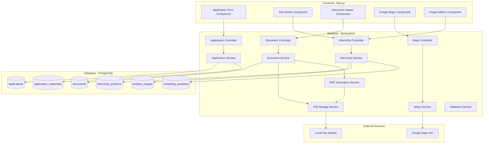
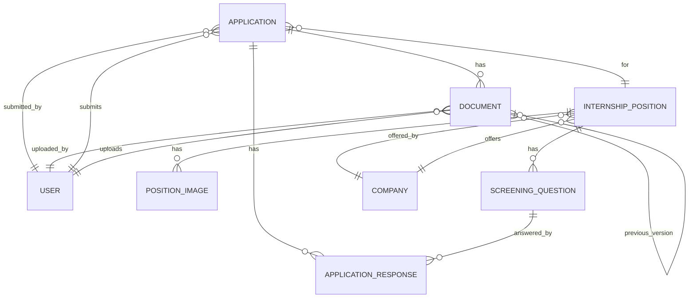

# Design Document: Phase 1 Enhancements

## Overview

Phase 1 Enhancements transform the UTCC Internship & Trip Management System from basic functionality to production-ready by implementing three critical feature sets:

1. **Comprehensive Application Forms** - Replace simple "Apply" button with multi-section forms collecting personal information, academic details, documents, and company-specific screening questions
2. **Enhanced Job Details with Google Maps** - Provide students with complete internship information including salary ranges, duration, benefits, contact details, company images, and interactive location maps showing distance from UTCC
3. **Document Management System** - Enable secure upload, storage, versioning, and viewing of application documents (CV, transcripts) and system-generated documents (recommendation letters, agreements, certificates)

These enhancements address critical gaps where students currently cannot provide application information, job postings lack decision-making details, and no document storage exists.

### Key Design Decisions

- **File Storage**: Local filesystem storage with path structure `/uploads/{year}/{month}/{uuid}.{extension}` for simplicity and cost-effectiveness, with architecture supporting future S3 migration
- **Google Maps Integration**: Client-side JavaScript API for embedded maps, server-side Geocoding and Distance Matrix APIs for calculations with 24-hour caching to minimize API costs
- **Document Security**: Role-based access control with ownership verification, signed URLs for external sharing, and comprehensive audit logging
- **Database Extensions**: Extend existing `applications` and `internship_positions` tables rather than creating separate profile tables to maintain data consistency
- **PDF Generation**: Use iText library for server-side PDF generation from templates with Thai language support


## Architecture

### System Components



### Component Responsibilities

**Frontend Components:**
- **Application Form Component**: Multi-step form with validation, file upload, preview, and submission
- **Job Details Component**: Display enhanced internship information with responsive layout
- **Document Viewer Component**: Embedded PDF/image viewer with zoom and navigation controls
- **Google Maps Component**: Interactive map with markers, distance calculation, and directions link
- **Image Gallery Component**: Responsive image carousel with lightbox viewer

**Backend Services:**
- **Application Service**: Handle application CRUD, validation, status management, and screening question responses
- **Document Service**: Manage document upload, storage, retrieval, versioning, and access control
- **Internship Service**: Manage internship positions, images, and screening questions
- **Maps Service**: Geocoding, distance calculation, travel time estimation with caching
- **File Storage Service**: Abstract file operations supporting local filesystem and future cloud storage
- **PDF Generation Service**: Generate documents from templates with data population
- **Validation Service**: Centralized validation for forms, files, and business rules

### Data Flow

**Application Submission Flow:**
```
1. Student fills application form → Frontend validation
2. Student uploads documents → POST /api/v1/documents/upload → Document Service
3. Document Service validates file → Stores to filesystem → Saves metadata to DB
4. Student previews application → GET /api/v1/applications/preview
5. Student submits → POST /api/v1/applications → Application Service
6. Application Service validates → Saves application → Associates documents → Returns application ID
7. System sends notification to company
```

**Document Access Flow:**
```
1. User requests document → GET /api/v1/documents/{id}
2. Document Service verifies JWT token → Checks user permissions
3. If authorized → Streams file from filesystem with appropriate headers
4. If unauthorized → Returns 403 Forbidden
5. Logs access attempt to audit log
```

**Maps Integration Flow:**
```
1. Student views job details → Frontend loads Google Maps JavaScript API
2. Frontend requests distance → GET /api/v1/maps/distance?address={address}
3. Maps Service checks cache → If miss, calls Google Geocoding API
4. Maps Service calls Distance Matrix API → Calculates distance and travel time
5. Maps Service caches result for 24 hours → Returns to frontend
6. Frontend displays map with marker and distance information
```


## Components and Interfaces

### Backend Components

#### 1. Application Controller

**Endpoints:**

```java
@RestController
@RequestMapping("/api/v1/applications")
public class ApplicationController {
    
    // Create new application
    @PostMapping
    public ResponseEntity<ApplicationResponse> createApplication(
        @Valid @RequestBody CreateApplicationRequest request,
        @AuthenticationPrincipal UserDetails userDetails
    );
    
    // Update pending application
    @PutMapping("/{id}")
    public ResponseEntity<ApplicationResponse> updateApplication(
        @PathVariable UUID id,
        @Valid @RequestBody UpdateApplicationRequest request,
        @AuthenticationPrincipal UserDetails userDetails
    );
    
    // Get application preview
    @GetMapping("/{id}/preview")
    public ResponseEntity<ApplicationPreviewResponse> getApplicationPreview(
        @PathVariable UUID id,
        @AuthenticationPrincipal UserDetails userDetails
    );
    
    // Get application documents
    @GetMapping("/{id}/documents")
    public ResponseEntity<List<DocumentMetadataResponse>> getApplicationDocuments(
        @PathVariable UUID id,
        @AuthenticationPrincipal UserDetails userDetails
    );
}
```

**Request/Response DTOs:**

```java
public class CreateApplicationRequest {
    @NotNull private UUID internshipPositionId;
    @NotBlank @Size(max = 200) private String fullName;
    @Pattern(regexp = "^0\\d{9}$") private String phone;
    @Email private String email;
    @Size(max = 500) private String address;
    @DecimalMin("0.00") @DecimalMax("4.00") private BigDecimal gpa;
    @NotBlank private String major;
    @Min(1) @Max(6) private Integer year;
    @Size(max = 2000) private String coverLetter;
    @Size(max = 500) private String portfolioUrl;
    private List<UUID> documentIds; // References to uploaded documents
    private List<ScreeningQuestionResponse> screeningResponses;
}

public class ScreeningQuestionResponse {
    @NotNull private UUID questionId;
    @NotBlank private String responseText;
}

public class ApplicationResponse {
    private UUID id;
    private UUID studentId;
    private UUID internshipPositionId;
    private String status;
    private String fullName;
    private String phone;
    private String email;
    private String address;
    private BigDecimal gpa;
    private String major;
    private Integer year;
    private String coverLetter;
    private String portfolioUrl;
    private Instant createdAt;
    private Instant updatedAt;
    private boolean editable;
}
```

#### 2. Document Controller

**Endpoints:**

```java
@RestController
@RequestMapping("/api/v1/documents")
public class DocumentController {
    
    // Upload document
    @PostMapping("/upload")
    public ResponseEntity<DocumentUploadResponse> uploadDocument(
        @RequestParam("file") MultipartFile file,
        @RequestParam("entityType") String entityType,
        @RequestParam(value = "entityId", required = false) UUID entityId,
        @RequestParam("documentType") String documentType,
        @AuthenticationPrincipal UserDetails userDetails
    );
    
    // Get document file
    @GetMapping("/{id}")
    public ResponseEntity<Resource> getDocument(
        @PathVariable UUID id,
        @AuthenticationPrincipal UserDetails userDetails
    );
    
    // Get document metadata
    @GetMapping("/{id}/metadata")
    public ResponseEntity<DocumentMetadataResponse> getDocumentMetadata(
        @PathVariable UUID id,
        @AuthenticationPrincipal UserDetails userDetails
    );
    
    // Get document version history
    @GetMapping("/{id}/versions")
    public ResponseEntity<List<DocumentMetadataResponse>> getDocumentVersions(
        @PathVariable UUID id,
        @AuthenticationPrincipal UserDetails userDetails
    );
    
    // Generate document from template
    @PostMapping("/generate/{type}")
    public ResponseEntity<DocumentUploadResponse> generateDocument(
        @PathVariable String type,
        @RequestBody Map<String, Object> templateData,
        @AuthenticationPrincipal UserDetails userDetails
    );
}
```

**Response DTOs:**

```java
public class DocumentUploadResponse {
    private UUID id;
    private String filename;
    private String fileType;
    private Long fileSize;
    private String documentType;
    private Integer version;
    private Instant uploadedAt;
}

public class DocumentMetadataResponse {
    private UUID id;
    private String filename;
    private String fileType;
    private Long fileSize;
    private String documentType;
    private Integer version;
    private UUID uploadedBy;
    private String uploaderName;
    private Instant uploadedAt;
    private boolean superseded;
    private Instant supersededAt;
}
```

#### 3. Internship Controller Extensions

**New Endpoints:**

```java
@RestController
@RequestMapping("/api/v1/internships")
public class InternshipController {
    
    // Update internship with enhanced details
    @PutMapping("/{id}")
    public ResponseEntity<InternshipDetailResponse> updateInternship(
        @PathVariable UUID id,
        @Valid @RequestBody UpdateInternshipRequest request,
        @AuthenticationPrincipal UserDetails userDetails
    );
    
    // Upload position images
    @PostMapping("/{id}/images")
    public ResponseEntity<List<PositionImageResponse>> uploadImages(
        @PathVariable UUID id,
        @RequestParam("images") List<MultipartFile> images,
        @AuthenticationPrincipal UserDetails userDetails
    );
    
    // Add screening questions
    @PostMapping("/{id}/screening-questions")
    public ResponseEntity<List<ScreeningQuestionResponse>> addScreeningQuestions(
        @PathVariable UUID id,
        @RequestBody List<CreateScreeningQuestionRequest> questions,
        @AuthenticationPrincipal UserDetails userDetails
    );
    
    // Get internship with full details
    @GetMapping("/{id}")
    public ResponseEntity<InternshipDetailResponse> getInternshipDetails(
        @PathVariable UUID id
    );
}
```

**Request/Response DTOs:**

```java
public class UpdateInternshipRequest {
    @NotBlank private String title;
    private String description;
    private String requirements;
    private String location;
    private String mode;
    @Min(1) private Integer slots;
    private BigDecimal salaryMin;
    private BigDecimal salaryMax;
    @NotNull private LocalDate startDate;
    @NotNull private LocalDate endDate;
    @NotNull private LocalDate applicationDeadline;
    private List<String> benefits;
    @NotNull private String internshipType; // FULL_TIME, PART_TIME
    @Email private String contactEmail;
    private String contactPhone;
    private String contactLine;
}

public class InternshipDetailResponse {
    private UUID id;
    private CompanyBasicInfo company;
    private String title;
    private String description;
    private String requirements;
    private String location;
    private String mode;
    private Integer slots;
    private String status;
    private BigDecimal salaryMin;
    private BigDecimal salaryMax;
    private LocalDate startDate;
    private LocalDate endDate;
    private LocalDate applicationDeadline;
    private List<String> benefits;
    private String internshipType;
    private String contactEmail;
    private String contactPhone;
    private String contactLine;
    private List<PositionImageResponse> images;
    private List<ScreeningQuestionResponse> screeningQuestions;
    private Instant createdAt;
    private boolean applicationOpen;
}

public class CreateScreeningQuestionRequest {
    @NotBlank @Size(max = 500) private String questionText;
    @NotNull private String questionType; // SHORT_TEXT, LONG_TEXT, SINGLE_CHOICE
    private boolean required;
    private List<String> choices; // For SINGLE_CHOICE type
    private Integer displayOrder;
}
```

#### 4. Maps Controller

**Endpoints:**

```java
@RestController
@RequestMapping("/api/v1/maps")
public class MapsController {
    
    // Get distance from UTCC
    @GetMapping("/distance")
    public ResponseEntity<DistanceResponse> getDistanceFromUTCC(
        @RequestParam String address
    );
    
    // Geocode address
    @GetMapping("/geocode")
    public ResponseEntity<GeocodeResponse> geocodeAddress(
        @RequestParam String address
    );
}
```

**Response DTOs:**

```java
public class DistanceResponse {
    private String address;
    private Double latitude;
    private Double longitude;
    private Double distanceKm;
    private Integer travelTimeMinutes;
    private String travelMode; // DRIVING
    private boolean cached;
}

public class GeocodeResponse {
    private String address;
    private Double latitude;
    private Double longitude;
    private String formattedAddress;
}
```

### Frontend Components

#### 1. Application Form Component

**Component Structure:**

```typescript
// components/ApplicationForm.tsx
interface ApplicationFormProps {
  internshipId: string;
  onSuccess: (applicationId: string) => void;
  onCancel: () => void;
}

interface ApplicationFormData {
  fullName: string;
  phone: string;
  email: string;
  address: string;
  gpa: number;
  major: string;
  year: number;
  coverLetter: string;
  portfolioUrl: string;
  cvDocument: File | null;
  transcriptDocument: File | null;
  screeningResponses: Record<string, string>;
}

const ApplicationForm: React.FC<ApplicationFormProps> = ({
  internshipId,
  onSuccess,
  onCancel
}) => {
  const [formData, setFormData] = useState<ApplicationFormData>(initialState);
  const [errors, setErrors] = useState<Record<string, string>>({});
  const [step, setStep] = useState<'form' | 'preview' | 'success'>('form');
  const [uploadedDocs, setUploadedDocs] = useState<DocumentUpload[]>([]);
  
  // Form sections: Personal Info, Academic Info, Documents, Screening Questions
  // Validation on blur and before preview
  // File upload with progress indicator
  // Preview with all data in read-only format
  // Submit with loading state
};
```

**Key Features:**
- Multi-step form with progress indicator
- Real-time validation with error messages
- File upload with drag-and-drop support
- Preview mode before submission
- Auto-save to localStorage
- Responsive mobile layout

#### 2. Job Details Component

**Component Structure:**

```typescript
// components/JobDetails.tsx
interface JobDetailsProps {
  internshipId: string;
}

const JobDetails: React.FC<JobDetailsProps> = ({ internshipId }) => {
  const [internship, setInternship] = useState<InternshipDetail | null>(null);
  const [distance, setDistance] = useState<DistanceInfo | null>(null);
  
  // Fetch internship details
  // Fetch distance from UTCC
  // Display enhanced information
  // Render image gallery
  // Embed Google Maps
  // Show Apply button with deadline check
};
```

**Layout Sections:**
- Hero section with primary image and key details
- Company information with logo
- Job description and requirements
- Salary, duration, and benefits
- Contact information
- Image gallery
- Google Maps with distance
- Screening questions preview
- Apply button

#### 3. Document Viewer Component

**Component Structure:**

```typescript
// components/DocumentViewer.tsx
interface DocumentViewerProps {
  documentId: string;
  onClose: () => void;
}

const DocumentViewer: React.FC<DocumentViewerProps> = ({
  documentId,
  onClose
}) => {
  const [document, setDocument] = useState<DocumentMetadata | null>(null);
  const [currentPage, setCurrentPage] = useState(1);
  const [zoom, setZoom] = useState(1.0);
  
  // Load document metadata
  // Render PDF using react-pdf or iframe
  // Render images in modal
  // Provide zoom and navigation controls
  // Download button
};
```

#### 4. Google Maps Component

**Component Structure:**

```typescript
// components/GoogleMapsEmbed.tsx
interface GoogleMapsEmbedProps {
  address: string;
  companyName: string;
}

const GoogleMapsEmbed: React.FC<GoogleMapsEmbedProps> = ({
  address,
  companyName
}) => {
  const [distance, setDistance] = useState<DistanceInfo | null>(null);
  const [mapLoaded, setMapLoaded] = useState(false);
  
  // Load Google Maps JavaScript API
  // Geocode company address
  // Display map with markers (UTCC and company)
  // Show distance and travel time
  // Provide "Get Directions" link
};
```

**Integration:**
- Use `@react-google-maps/api` library
- Load API key from environment variable
- Display UTCC marker and company marker
- Draw route line between locations
- Show info window with distance details


## Data Models

### Database Schema Changes

#### 1. Extended Application Entity

```java
@Entity
@Table(name = "applications")
public class Application {
    @Id
    @GeneratedValue
    @UuidGenerator
    private UUID id;

    @Enumerated(EnumType.STRING)
    @Column(nullable = false, length = 30)
    private ApplicationType type;

    @Enumerated(EnumType.STRING)
    @Column(nullable = false, length = 30)
    private ApplicationStatus status = ApplicationStatus.PENDING;

    @ManyToOne
    @JoinColumn(name = "student_id", nullable = false)
    private User student;

    @ManyToOne
    @JoinColumn(name = "internship_position_id")
    private InternshipPosition internshipPosition;

    // NEW FIELDS FOR PHASE 1
    @Column(name = "full_name", length = 200)
    private String fullName;

    @Column(name = "phone", length = 20)
    private String phone;

    @Column(name = "email", length = 120)
    private String email;

    @Column(name = "address", length = 500)
    private String address;

    @Column(name = "gpa", precision = 3, scale = 2)
    private BigDecimal gpa;

    @Column(name = "major", length = 120)
    private String major;

    @Column(name = "year")
    private Integer year;

    @Column(name = "cover_letter", columnDefinition = "TEXT")
    private String coverLetter;

    @Column(name = "portfolio_url", length = 500)
    private String portfolioUrl;

    @Column(name = "created_at", nullable = false)
    private Instant createdAt = Instant.now();

    @Column(name = "updated_at")
    private Instant updatedAt;

    @Column(name = "submitted_at")
    private Instant submittedAt;

    // Existing fields...
    @Column(columnDefinition = "TEXT")
    private String reason;

    @OneToMany(mappedBy = "application", cascade = CascadeType.ALL)
    private List<ApplicationResponse> screeningResponses = new ArrayList<>();

    @OneToMany(mappedBy = "application")
    private List<ApprovalHistory> approvals = new ArrayList<>();
}
```

**Migration SQL:**

```sql
-- Add new columns to applications table
ALTER TABLE applications
ADD COLUMN full_name VARCHAR(200),
ADD COLUMN phone VARCHAR(20),
ADD COLUMN email VARCHAR(120),
ADD COLUMN address VARCHAR(500),
ADD COLUMN gpa DECIMAL(3, 2),
ADD COLUMN major VARCHAR(120),
ADD COLUMN year INTEGER,
ADD COLUMN cover_letter TEXT,
ADD COLUMN portfolio_url VARCHAR(500),
ADD COLUMN updated_at TIMESTAMP,
ADD COLUMN submitted_at TIMESTAMP;

-- Add indexes for common queries
CREATE INDEX idx_applications_status ON applications(status);
CREATE INDEX idx_applications_student_id ON applications(student_id);
CREATE INDEX idx_applications_internship_position_id ON applications(internship_position_id);
CREATE INDEX idx_applications_created_at ON applications(created_at);
```

#### 2. New Document Entity

```java
@Entity
@Table(name = "documents")
public class Document {
    @Id
    @GeneratedValue
    @UuidGenerator
    private UUID id;

    @Column(nullable = false, length = 255)
    private String filename;

    @Column(name = "file_type", nullable = false, length = 50)
    private String fileType; // MIME type

    @Column(name = "file_size", nullable = false)
    private Long fileSize; // bytes

    @Column(name = "file_path", nullable = false, length = 500)
    private String filePath; // /uploads/2024/01/uuid.pdf

    @ManyToOne
    @JoinColumn(name = "uploaded_by", nullable = false)
    private User uploadedBy;

    @Column(name = "uploaded_at", nullable = false)
    private Instant uploadedAt = Instant.now();

    @Enumerated(EnumType.STRING)
    @Column(name = "entity_type", nullable = false, length = 50)
    private EntityType entityType; // APPLICATION, STUDENT_PROFILE, SYSTEM_TEMPLATE

    @Column(name = "entity_id")
    private UUID entityId; // Reference to parent entity

    @Enumerated(EnumType.STRING)
    @Column(name = "document_type", nullable = false, length = 50)
    private DocumentType documentType; // CV, TRANSCRIPT, RECOMMENDATION_LETTER, etc.

    @Column(name = "version", nullable = false)
    private Integer version = 1;

    @ManyToOne
    @JoinColumn(name = "previous_version_id")
    private Document previousVersion;

    @Column(name = "superseded", nullable = false)
    private boolean superseded = false;

    @Column(name = "superseded_at")
    private Instant supersededAt;

    @Column(name = "description", length = 500)
    private String description;
}

public enum EntityType {
    APPLICATION,
    STUDENT_PROFILE,
    COMPANY_PROFILE,
    SYSTEM_TEMPLATE
}

public enum DocumentType {
    CV,
    TRANSCRIPT,
    ID_CARD,
    PORTFOLIO,
    RECOMMENDATION_LETTER,
    INTERNSHIP_AGREEMENT,
    CERTIFICATE,
    OTHER
}
```

**Migration SQL:**

```sql
-- Create documents table
CREATE TABLE documents (
    id UUID PRIMARY KEY,
    filename VARCHAR(255) NOT NULL,
    file_type VARCHAR(50) NOT NULL,
    file_size BIGINT NOT NULL,
    file_path VARCHAR(500) NOT NULL,
    uploaded_by UUID NOT NULL REFERENCES users(id),
    uploaded_at TIMESTAMP NOT NULL DEFAULT CURRENT_TIMESTAMP,
    entity_type VARCHAR(50) NOT NULL,
    entity_id UUID,
    document_type VARCHAR(50) NOT NULL,
    version INTEGER NOT NULL DEFAULT 1,
    previous_version_id UUID REFERENCES documents(id),
    superseded BOOLEAN NOT NULL DEFAULT FALSE,
    superseded_at TIMESTAMP,
    description VARCHAR(500)
);

-- Indexes for performance
CREATE INDEX idx_documents_entity ON documents(entity_type, entity_id);
CREATE INDEX idx_documents_uploaded_by ON documents(uploaded_by);
CREATE INDEX idx_documents_uploaded_at ON documents(uploaded_at);
CREATE INDEX idx_documents_document_type ON documents(document_type);
CREATE INDEX idx_documents_superseded ON documents(superseded);
```

#### 3. Extended InternshipPosition Entity

```java
@Entity
@Table(name = "internship_positions")
public class InternshipPosition {
    @Id
    @GeneratedValue
    @UuidGenerator
    private UUID id;

    @ManyToOne
    @JoinColumn(name = "company_id", nullable = false)
    private Company company;

    @Column(nullable = false, length = 200)
    private String title;

    @Column(columnDefinition = "text")
    private String description;

    @Column(columnDefinition = "text")
    private String requirements;

    @Column(length = 120)
    private String location;

    @Column(length = 30)
    private String mode;

    @Column(nullable = false)
    private int slots;

    @Enumerated(EnumType.STRING)
    @Column(nullable = false, length = 30)
    private InternshipStatus status = InternshipStatus.OPEN;

    // NEW FIELDS FOR PHASE 1
    @Column(name = "salary_min", precision = 10, scale = 2)
    private BigDecimal salaryMin;

    @Column(name = "salary_max", precision = 10, scale = 2)
    private BigDecimal salaryMax;

    @Column(name = "start_date")
    private LocalDate startDate;

    @Column(name = "end_date")
    private LocalDate endDate;

    @Column(name = "application_deadline")
    private LocalDate applicationDeadline;

    @Column(name = "benefits", columnDefinition = "jsonb")
    @Convert(converter = StringListConverter.class)
    private List<String> benefits = new ArrayList<>();

    @Enumerated(EnumType.STRING)
    @Column(name = "internship_type", length = 30)
    private InternshipType internshipType; // FULL_TIME, PART_TIME

    @Column(name = "contact_email", length = 120)
    private String contactEmail;

    @Column(name = "contact_phone", length = 20)
    private String contactPhone;

    @Column(name = "contact_line", length = 100)
    private String contactLine;

    @Column(name = "created_at", nullable = false)
    private Instant createdAt = Instant.now();

    @OneToMany(mappedBy = "position", cascade = CascadeType.ALL, orphanRemoval = true)
    private List<PositionImage> images = new ArrayList<>();

    @OneToMany(mappedBy = "position", cascade = CascadeType.ALL, orphanRemoval = true)
    private List<ScreeningQuestion> screeningQuestions = new ArrayList<>();
}

public enum InternshipType {
    FULL_TIME,
    PART_TIME
}
```

**Migration SQL:**

```sql
-- Add new columns to internship_positions table
ALTER TABLE internship_positions
ADD COLUMN salary_min DECIMAL(10, 2),
ADD COLUMN salary_max DECIMAL(10, 2),
ADD COLUMN start_date DATE,
ADD COLUMN end_date DATE,
ADD COLUMN application_deadline DATE,
ADD COLUMN benefits JSONB,
ADD COLUMN internship_type VARCHAR(30),
ADD COLUMN contact_email VARCHAR(120),
ADD COLUMN contact_phone VARCHAR(20),
ADD COLUMN contact_line VARCHAR(100);

-- Add indexes
CREATE INDEX idx_internship_positions_application_deadline ON internship_positions(application_deadline);
CREATE INDEX idx_internship_positions_start_date ON internship_positions(start_date);
```

#### 4. New PositionImage Entity

```java
@Entity
@Table(name = "position_images")
public class PositionImage {
    @Id
    @GeneratedValue
    @UuidGenerator
    private UUID id;

    @ManyToOne
    @JoinColumn(name = "position_id", nullable = false)
    private InternshipPosition position;

    @Column(name = "image_url", nullable = false, length = 500)
    private String imageUrl; // Path or URL to image

    @Column(name = "display_order", nullable = false)
    private Integer displayOrder;

    @Column(name = "uploaded_at", nullable = false)
    private Instant uploadedAt = Instant.now();

    @Column(name = "alt_text", length = 200)
    private String altText;
}
```

**Migration SQL:**

```sql
-- Create position_images table
CREATE TABLE position_images (
    id UUID PRIMARY KEY,
    position_id UUID NOT NULL REFERENCES internship_positions(id) ON DELETE CASCADE,
    image_url VARCHAR(500) NOT NULL,
    display_order INTEGER NOT NULL,
    uploaded_at TIMESTAMP NOT NULL DEFAULT CURRENT_TIMESTAMP,
    alt_text VARCHAR(200)
);

-- Indexes
CREATE INDEX idx_position_images_position_id ON position_images(position_id);
CREATE INDEX idx_position_images_display_order ON position_images(position_id, display_order);
```

#### 5. New ScreeningQuestion Entity

```java
@Entity
@Table(name = "screening_questions")
public class ScreeningQuestion {
    @Id
    @GeneratedValue
    @UuidGenerator
    private UUID id;

    @ManyToOne
    @JoinColumn(name = "position_id", nullable = false)
    private InternshipPosition position;

    @Column(name = "question_text", nullable = false, length = 500)
    private String questionText;

    @Enumerated(EnumType.STRING)
    @Column(name = "question_type", nullable = false, length = 30)
    private QuestionType questionType; // SHORT_TEXT, LONG_TEXT, SINGLE_CHOICE

    @Column(name = "is_required", nullable = false)
    private boolean required = false;

    @Column(name = "choices", columnDefinition = "jsonb")
    @Convert(converter = StringListConverter.class)
    private List<String> choices = new ArrayList<>(); // For SINGLE_CHOICE type

    @Column(name = "display_order", nullable = false)
    private Integer displayOrder;
}

public enum QuestionType {
    SHORT_TEXT,  // Max 200 characters
    LONG_TEXT,   // Max 1000 characters
    SINGLE_CHOICE // Select one from choices
}
```

**Migration SQL:**

```sql
-- Create screening_questions table
CREATE TABLE screening_questions (
    id UUID PRIMARY KEY,
    position_id UUID NOT NULL REFERENCES internship_positions(id) ON DELETE CASCADE,
    question_text VARCHAR(500) NOT NULL,
    question_type VARCHAR(30) NOT NULL,
    is_required BOOLEAN NOT NULL DEFAULT FALSE,
    choices JSONB,
    display_order INTEGER NOT NULL
);

-- Indexes
CREATE INDEX idx_screening_questions_position_id ON screening_questions(position_id);
CREATE INDEX idx_screening_questions_display_order ON screening_questions(position_id, display_order);
```

#### 6. New ApplicationResponse Entity

```java
@Entity
@Table(name = "application_responses")
public class ApplicationResponse {
    @Id
    @GeneratedValue
    @UuidGenerator
    private UUID id;

    @ManyToOne
    @JoinColumn(name = "application_id", nullable = false)
    private Application application;

    @ManyToOne
    @JoinColumn(name = "question_id", nullable = false)
    private ScreeningQuestion question;

    @Column(name = "response_text", columnDefinition = "TEXT", nullable = false)
    private String responseText;

    @Column(name = "created_at", nullable = false)
    private Instant createdAt = Instant.now();
}
```

**Migration SQL:**

```sql
-- Create application_responses table
CREATE TABLE application_responses (
    id UUID PRIMARY KEY,
    application_id UUID NOT NULL REFERENCES applications(id) ON DELETE CASCADE,
    question_id UUID NOT NULL REFERENCES screening_questions(id),
    response_text TEXT NOT NULL,
    created_at TIMESTAMP NOT NULL DEFAULT CURRENT_TIMESTAMP
);

-- Indexes
CREATE INDEX idx_application_responses_application_id ON application_responses(application_id);
CREATE INDEX idx_application_responses_question_id ON application_responses(question_id);

-- Unique constraint: one response per question per application
CREATE UNIQUE INDEX idx_application_responses_unique ON application_responses(application_id, question_id);
```

### Entity Relationships



### Data Validation Rules

**Application Validation:**
- `fullName`: Required, 1-200 characters
- `phone`: Required, Thai mobile format (10 digits starting with 0)
- `email`: Required, valid email format
- `address`: Optional, max 500 characters
- `gpa`: Required, decimal 0.00-4.00
- `major`: Required, max 120 characters
- `year`: Required, integer 1-6
- `coverLetter`: Optional, max 2000 characters
- `portfolioUrl`: Optional, valid URL, max 500 characters

**Document Validation:**
- `filename`: Required, sanitized (no path traversal)
- `fileType`: Required, must be in allowed list (PDF, JPEG, PNG, WebP, ZIP)
- `fileSize`: Required, max 5MB for documents, 3MB for images
- `documentType`: Required, must be valid enum value

**InternshipPosition Validation:**
- `salaryMin`: Optional, positive decimal
- `salaryMax`: Optional, must be >= salaryMin if both provided
- `startDate`: Required, must be future date
- `endDate`: Required, must be after startDate
- `applicationDeadline`: Required, must be before startDate
- `benefits`: Optional, array of strings
- `internshipType`: Required, FULL_TIME or PART_TIME
- `contactEmail`: Optional, valid email format
- `contactPhone`: Optional, valid phone format

**ScreeningQuestion Validation:**
- `questionText`: Required, 1-500 characters
- `questionType`: Required, valid enum value
- `choices`: Required for SINGLE_CHOICE type, must have at least 2 options
- `displayOrder`: Required, positive integer
- Maximum 10 questions per position


## Error Handling

### Error Response Format

All API errors follow a consistent format:

```json
{
  "timestamp": "2024-01-15T10:30:00Z",
  "status": 400,
  "error": "Bad Request",
  "message": "Validation failed for application submission",
  "path": "/api/v1/applications",
  "errors": [
    {
      "field": "gpa",
      "message": "GPA must be between 0.00 and 4.00",
      "rejectedValue": "5.0"
    },
    {
      "field": "phone",
      "message": "Phone number must be 10 digits starting with 0",
      "rejectedValue": "123456789"
    }
  ]
}
```

### Error Categories

#### 1. Validation Errors (400 Bad Request)

**Scenarios:**
- Invalid form field values (GPA out of range, invalid email format)
- Missing required fields
- File validation failures (wrong format, size exceeded)
- Business rule violations (application deadline passed)

**Handling:**
- Return detailed field-level errors
- Frontend displays errors inline with form fields
- Preserve user input for correction

**Example:**
```java
@ExceptionHandler(MethodArgumentNotValidException.class)
public ResponseEntity<ErrorResponse> handleValidationException(
    MethodArgumentNotValidException ex
) {
    List<FieldError> fieldErrors = ex.getBindingResult()
        .getFieldErrors()
        .stream()
        .map(error -> new FieldError(
            error.getField(),
            error.getDefaultMessage(),
            error.getRejectedValue()
        ))
        .collect(Collectors.toList());
    
    ErrorResponse response = new ErrorResponse(
        HttpStatus.BAD_REQUEST.value(),
        "Validation failed",
        fieldErrors
    );
    
    return ResponseEntity.badRequest().body(response);
}
```

#### 2. Authentication Errors (401 Unauthorized)

**Scenarios:**
- Missing JWT token
- Expired JWT token
- Invalid JWT signature

**Handling:**
- Return 401 status
- Frontend redirects to login page
- Clear stored token

#### 3. Authorization Errors (403 Forbidden)

**Scenarios:**
- User attempts to access document they don't own
- Student tries to edit application after company reviewed
- Company tries to modify another company's position

**Handling:**
- Return 403 status with clear message
- Log security incident
- Frontend displays "Access Denied" message

**Example:**
```java
public Document getDocument(UUID documentId, UUID userId) {
    Document document = documentRepository.findById(documentId)
        .orElseThrow(() -> new ResourceNotFoundException("Document not found"));
    
    if (!hasDocumentAccess(document, userId)) {
        auditLogService.logSecurityIncident(
            userId,
            "UNAUTHORIZED_DOCUMENT_ACCESS",
            documentId
        );
        throw new AccessDeniedException(
            "You do not have permission to access this document"
        );
    }
    
    return document;
}
```

#### 4. Resource Not Found (404 Not Found)

**Scenarios:**
- Application ID doesn't exist
- Document file missing from filesystem
- Internship position not found

**Handling:**
- Return 404 status
- Frontend displays "Not Found" message
- Log warning for missing files

#### 5. File Upload Errors

**Scenarios:**
- File size exceeds limit (413 Payload Too Large)
- Unsupported file type (415 Unsupported Media Type)
- Storage quota exceeded (507 Insufficient Storage)
- Network interruption during upload

**Handling:**
- Return appropriate HTTP status
- Provide retry mechanism for network errors
- Display clear error message with file requirements

**Example:**
```java
@ExceptionHandler(MaxUploadSizeExceededException.class)
public ResponseEntity<ErrorResponse> handleFileSizeException(
    MaxUploadSizeExceededException ex
) {
    ErrorResponse response = new ErrorResponse(
        HttpStatus.PAYLOAD_TOO_LARGE.value(),
        "File size exceeds maximum allowed size of 5MB",
        null
    );
    
    return ResponseEntity.status(HttpStatus.PAYLOAD_TOO_LARGE).body(response);
}
```

#### 6. External Service Errors

**Scenarios:**
- Google Maps API quota exceeded
- Google Maps API request timeout
- Geocoding fails for invalid address

**Handling:**
- Return 503 Service Unavailable for temporary failures
- Display fallback UI (address text without map)
- Cache successful responses to reduce API calls
- Log errors for monitoring

**Example:**
```java
public DistanceResponse getDistanceFromUTCC(String address) {
    try {
        // Check cache first
        Optional<DistanceResponse> cached = cacheService.getDistance(address);
        if (cached.isPresent()) {
            return cached.get();
        }
        
        // Call Google Maps API
        DistanceResponse response = googleMapsService.calculateDistance(
            UTCC_COORDINATES,
            address
        );
        
        // Cache for 24 hours
        cacheService.putDistance(address, response, Duration.ofHours(24));
        
        return response;
    } catch (GoogleMapsApiException ex) {
        logger.error("Google Maps API error: {}", ex.getMessage());
        
        if (ex.isQuotaExceeded()) {
            throw new ServiceUnavailableException(
                "Map service temporarily unavailable. Please try again later."
            );
        }
        
        // Return partial response without distance
        return DistanceResponse.unavailable(address);
    }
}
```

#### 7. Concurrency Errors (409 Conflict)

**Scenarios:**
- Application modified by another user
- Document version conflict

**Handling:**
- Use optimistic locking with version field
- Return 409 status with current version
- Frontend prompts user to refresh and retry

**Example:**
```java
@Entity
@Table(name = "applications")
public class Application {
    @Version
    private Long version;
    
    // Other fields...
}

// Service method
public Application updateApplication(UUID id, UpdateRequest request, Long expectedVersion) {
    Application application = applicationRepository.findById(id)
        .orElseThrow(() -> new ResourceNotFoundException("Application not found"));
    
    if (!application.getVersion().equals(expectedVersion)) {
        throw new OptimisticLockException(
            "Application was modified by another user. Please refresh and try again."
        );
    }
    
    // Update fields...
    return applicationRepository.save(application);
}
```

### Frontend Error Handling Strategy

**Form Validation:**
```typescript
const validateField = (name: string, value: any): string | null => {
  switch (name) {
    case 'gpa':
      if (value < 0 || value > 4) {
        return 'GPA must be between 0.00 and 4.00';
      }
      break;
    case 'phone':
      if (!/^0\d{9}$/.test(value)) {
        return 'Phone number must be 10 digits starting with 0';
      }
      break;
    case 'email':
      if (!/^[^\s@]+@[^\s@]+\.[^\s@]+$/.test(value)) {
        return 'Please enter a valid email address';
      }
      break;
  }
  return null;
};
```

**File Upload Error Handling:**
```typescript
const handleFileUpload = async (file: File) => {
  try {
    // Validate file size
    if (file.size > 5 * 1024 * 1024) {
      setError('File size must not exceed 5MB');
      return;
    }
    
    // Validate file type
    const allowedTypes = ['application/pdf'];
    if (!allowedTypes.includes(file.type)) {
      setError('Only PDF files are allowed');
      return;
    }
    
    // Upload with progress
    const response = await uploadDocument(file, (progress) => {
      setUploadProgress(progress);
    });
    
    setUploadedDocument(response);
    setError(null);
  } catch (error) {
    if (error.response?.status === 413) {
      setError('File is too large. Maximum size is 5MB.');
    } else if (error.response?.status === 507) {
      setError('Storage limit reached. Please contact support.');
    } else if (error.message === 'Network Error') {
      setError('Upload failed due to network error. Please try again.');
      setShowRetry(true);
    } else {
      setError('Upload failed. Please try again.');
    }
  }
};
```

**API Error Handling:**
```typescript
const handleApiError = (error: any) => {
  if (error.response) {
    // Server responded with error status
    const { status, data } = error.response;
    
    switch (status) {
      case 400:
        // Validation errors
        if (data.errors) {
          setFieldErrors(data.errors);
        } else {
          showToast('error', data.message || 'Invalid request');
        }
        break;
      case 401:
        // Unauthorized - redirect to login
        localStorage.removeItem('token');
        router.push('/login');
        break;
      case 403:
        showToast('error', 'You do not have permission to perform this action');
        break;
      case 404:
        showToast('error', 'Resource not found');
        break;
      case 409:
        showToast('error', 'This item was modified by another user. Please refresh.');
        break;
      case 503:
        showToast('error', 'Service temporarily unavailable. Please try again later.');
        break;
      default:
        showToast('error', 'An unexpected error occurred');
    }
  } else if (error.request) {
    // Request made but no response
    showToast('error', 'Network error. Please check your connection.');
  } else {
    // Other errors
    showToast('error', 'An error occurred. Please try again.');
  }
};
```

### Logging Strategy

**Application Logs:**
- INFO: Successful operations (application submitted, document uploaded)
- WARN: Validation failures, missing files, API quota warnings
- ERROR: Unexpected exceptions, external service failures, file system errors

**Audit Logs:**
- Document access attempts (success and failure)
- Application status changes
- Security incidents (unauthorized access attempts)

**Example:**
```java
@Service
public class AuditLogService {
    public void logDocumentAccess(UUID userId, UUID documentId, boolean granted) {
        AuditLog log = new AuditLog();
        log.setUserId(userId);
        log.setAction("DOCUMENT_ACCESS");
        log.setResourceType("DOCUMENT");
        log.setResourceId(documentId);
        log.setResult(granted ? "GRANTED" : "DENIED");
        log.setTimestamp(Instant.now());
        
        auditLogRepository.save(log);
        
        if (!granted) {
            logger.warn("Unauthorized document access attempt: user={}, document={}",
                userId, documentId);
        }
    }
}
```


## Testing Strategy

### Unit Testing

**Backend Unit Tests:**

Test individual service methods and business logic in isolation using mocks.

**Application Service Tests:**
```java
@ExtendWith(MockitoExtension.class)
class ApplicationServiceTest {
    @Mock
    private ApplicationRepository applicationRepository;
    
    @Mock
    private DocumentService documentService;
    
    @Mock
    private NotificationService notificationService;
    
    @InjectMocks
    private ApplicationService applicationService;
    
    @Test
    void createApplication_WithValidData_ShouldSucceed() {
        // Given
        CreateApplicationRequest request = createValidRequest();
        User student = createMockStudent();
        
        when(applicationRepository.save(any())).thenAnswer(i -> i.getArgument(0));
        
        // When
        ApplicationResponse response = applicationService.createApplication(
            request,
            student.getId()
        );
        
        // Then
        assertNotNull(response.getId());
        assertEquals(request.getFullName(), response.getFullName());
        assertEquals(ApplicationStatus.PENDING, response.getStatus());
        verify(notificationService).sendApplicationSubmittedNotification(any());
    }
    
    @Test
    void updateApplication_WhenNotPending_ShouldThrowException() {
        // Given
        Application application = createMockApplication();
        application.setStatus(ApplicationStatus.REVIEWING);
        
        when(applicationRepository.findById(any())).thenReturn(Optional.of(application));
        
        // When/Then
        assertThrows(
            IllegalStateException.class,
            () -> applicationService.updateApplication(application.getId(), new UpdateApplicationRequest())
        );
    }
    
    @Test
    void validateGpa_WithInvalidValue_ShouldThrowException() {
        // Given
        BigDecimal invalidGpa = new BigDecimal("5.0");
        
        // When/Then
        assertThrows(
            ValidationException.class,
            () -> applicationService.validateGpa(invalidGpa)
        );
    }
}
```

**Document Service Tests:**
```java
@ExtendWith(MockitoExtension.class)
class DocumentServiceTest {
    @Mock
    private DocumentRepository documentRepository;
    
    @Mock
    private FileStorageService fileStorageService;
    
    @InjectMocks
    private DocumentService documentService;
    
    @Test
    void uploadDocument_WithValidPdf_ShouldSucceed() {
        // Given
        MockMultipartFile file = new MockMultipartFile(
            "file",
            "resume.pdf",
            "application/pdf",
            "PDF content".getBytes()
        );
        
        when(fileStorageService.store(any(), any())).thenReturn("/uploads/2024/01/uuid.pdf");
        when(documentRepository.save(any())).thenAnswer(i -> i.getArgument(0));
        
        // When
        DocumentUploadResponse response = documentService.uploadDocument(
            file,
            EntityType.APPLICATION,
            UUID.randomUUID(),
            DocumentType.CV,
            UUID.randomUUID()
        );
        
        // Then
        assertNotNull(response.getId());
        assertEquals("resume.pdf", response.getFilename());
        assertEquals("application/pdf", response.getFileType());
    }
    
    @Test
    void uploadDocument_WithOversizedFile_ShouldThrowException() {
        // Given
        byte[] largeContent = new byte[6 * 1024 * 1024]; // 6MB
        MockMultipartFile file = new MockMultipartFile(
            "file",
            "large.pdf",
            "application/pdf",
            largeContent
        );
        
        // When/Then
        assertThrows(
            FileSizeExceededException.class,
            () -> documentService.uploadDocument(file, EntityType.APPLICATION, null, DocumentType.CV, UUID.randomUUID())
        );
    }
    
    @Test
    void hasDocumentAccess_WhenOwner_ShouldReturnTrue() {
        // Given
        UUID userId = UUID.randomUUID();
        Document document = createMockDocument();
        document.setUploadedBy(createMockUser(userId));
        
        // When
        boolean hasAccess = documentService.hasDocumentAccess(document, userId);
        
        // Then
        assertTrue(hasAccess);
    }
}
```

**Maps Service Tests:**
```java
@ExtendWith(MockitoExtension.class)
class MapsServiceTest {
    @Mock
    private GoogleMapsClient googleMapsClient;
    
    @Mock
    private CacheService cacheService;
    
    @InjectMocks
    private MapsService mapsService;
    
    @Test
    void getDistanceFromUTCC_WithValidAddress_ShouldReturnDistance() {
        // Given
        String address = "123 Sukhumvit Rd, Bangkok";
        GeocodeResult geocodeResult = createMockGeocodeResult(13.7563, 100.5018);
        DistanceMatrixResult distanceResult = createMockDistanceResult(5.2, 25);
        
        when(cacheService.getDistance(address)).thenReturn(Optional.empty());
        when(googleMapsClient.geocode(address)).thenReturn(geocodeResult);
        when(googleMapsClient.calculateDistance(any(), any())).thenReturn(distanceResult);
        
        // When
        DistanceResponse response = mapsService.getDistanceFromUTCC(address);
        
        // Then
        assertEquals(5.2, response.getDistanceKm());
        assertEquals(25, response.getTravelTimeMinutes());
        verify(cacheService).putDistance(eq(address), any(), any());
    }
    
    @Test
    void getDistanceFromUTCC_WithCachedResult_ShouldReturnFromCache() {
        // Given
        String address = "123 Sukhumvit Rd, Bangkok";
        DistanceResponse cachedResponse = createMockDistanceResponse();
        
        when(cacheService.getDistance(address)).thenReturn(Optional.of(cachedResponse));
        
        // When
        DistanceResponse response = mapsService.getDistanceFromUTCC(address);
        
        // Then
        assertEquals(cachedResponse, response);
        assertTrue(response.isCached());
        verify(googleMapsClient, never()).geocode(any());
    }
}
```

**Frontend Unit Tests:**

Test React components and utility functions using Jest and React Testing Library.

```typescript
// ApplicationForm.test.tsx
describe('ApplicationForm', () => {
  it('should validate GPA field', () => {
    render(<ApplicationForm internshipId="123" onSuccess={jest.fn()} onCancel={jest.fn()} />);
    
    const gpaInput = screen.getByLabelText('GPA');
    fireEvent.change(gpaInput, { target: { value: '5.0' } });
    fireEvent.blur(gpaInput);
    
    expect(screen.getByText('GPA must be between 0.00 and 4.00')).toBeInTheDocument();
  });
  
  it('should validate phone number format', () => {
    render(<ApplicationForm internshipId="123" onSuccess={jest.fn()} onCancel={jest.fn()} />);
    
    const phoneInput = screen.getByLabelText('Phone Number');
    fireEvent.change(phoneInput, { target: { value: '123456789' } });
    fireEvent.blur(phoneInput);
    
    expect(screen.getByText('Phone number must be 10 digits starting with 0')).toBeInTheDocument();
  });
  
  it('should disable submit button when form is invalid', () => {
    render(<ApplicationForm internshipId="123" onSuccess={jest.fn()} onCancel={jest.fn()} />);
    
    const submitButton = screen.getByRole('button', { name: /preview/i });
    expect(submitButton).toBeDisabled();
  });
  
  it('should show preview when all fields are valid', async () => {
    render(<ApplicationForm internshipId="123" onSuccess={jest.fn()} onCancel={jest.fn()} />);
    
    // Fill all required fields
    fireEvent.change(screen.getByLabelText('Full Name'), { target: { value: 'John Doe' } });
    fireEvent.change(screen.getByLabelText('Phone Number'), { target: { value: '0812345678' } });
    fireEvent.change(screen.getByLabelText('Email'), { target: { value: 'john@example.com' } });
    fireEvent.change(screen.getByLabelText('GPA'), { target: { value: '3.5' } });
    
    const previewButton = screen.getByRole('button', { name: /preview/i });
    fireEvent.click(previewButton);
    
    await waitFor(() => {
      expect(screen.getByText('Application Preview')).toBeInTheDocument();
    });
  });
});
```

### Integration Testing

**API Integration Tests:**

Test complete request/response cycles with real database using TestContainers.

```java
@SpringBootTest(webEnvironment = SpringBootTest.WebEnvironment.RANDOM_PORT)
@Testcontainers
class ApplicationControllerIntegrationTest {
    @Container
    static PostgreSQLContainer<?> postgres = new PostgreSQLContainer<>("postgres:15");
    
    @Autowired
    private TestRestTemplate restTemplate;
    
    @Autowired
    private ApplicationRepository applicationRepository;
    
    private String authToken;
    
    @BeforeEach
    void setUp() {
        authToken = authenticateAsStudent();
    }
    
    @Test
    void createApplication_WithValidData_ShouldReturn201() {
        // Given
        CreateApplicationRequest request = CreateApplicationRequest.builder()
            .internshipPositionId(UUID.randomUUID())
            .fullName("John Doe")
            .phone("0812345678")
            .email("john@example.com")
            .address("123 Main St")
            .gpa(new BigDecimal("3.5"))
            .major("Computer Science")
            .year(3)
            .coverLetter("I am interested in this position")
            .build();
        
        HttpHeaders headers = new HttpHeaders();
        headers.setBearerAuth(authToken);
        HttpEntity<CreateApplicationRequest> entity = new HttpEntity<>(request, headers);
        
        // When
        ResponseEntity<ApplicationResponse> response = restTemplate.postForEntity(
            "/api/v1/applications",
            entity,
            ApplicationResponse.class
        );
        
        // Then
        assertEquals(HttpStatus.CREATED, response.getStatusCode());
        assertNotNull(response.getBody().getId());
        assertEquals("John Doe", response.getBody().getFullName());
        
        // Verify database
        Application saved = applicationRepository.findById(response.getBody().getId()).orElseThrow();
        assertEquals("John Doe", saved.getFullName());
    }
    
    @Test
    void updateApplication_WhenNotOwner_ShouldReturn403() {
        // Given
        Application application = createMockApplication();
        applicationRepository.save(application);
        
        String otherUserToken = authenticateAsOtherStudent();
        HttpHeaders headers = new HttpHeaders();
        headers.setBearerAuth(otherUserToken);
        
        UpdateApplicationRequest request = new UpdateApplicationRequest();
        request.setFullName("Updated Name");
        
        HttpEntity<UpdateApplicationRequest> entity = new HttpEntity<>(request, headers);
        
        // When
        ResponseEntity<ErrorResponse> response = restTemplate.exchange(
            "/api/v1/applications/" + application.getId(),
            HttpMethod.PUT,
            entity,
            ErrorResponse.class
        );
        
        // Then
        assertEquals(HttpStatus.FORBIDDEN, response.getStatusCode());
    }
}
```

**Document Upload Integration Tests:**

```java
@SpringBootTest(webEnvironment = SpringBootTest.WebEnvironment.RANDOM_PORT)
class DocumentControllerIntegrationTest {
    @Autowired
    private TestRestTemplate restTemplate;
    
    @TempDir
    Path tempDir;
    
    @Test
    void uploadDocument_WithValidPdf_ShouldReturn200() throws IOException {
        // Given
        byte[] pdfContent = createMockPdfContent();
        MockMultipartFile file = new MockMultipartFile(
            "file",
            "resume.pdf",
            "application/pdf",
            pdfContent
        );
        
        MultiValueMap<String, Object> body = new LinkedMultiValueMap<>();
        body.add("file", file.getResource());
        body.add("entityType", "APPLICATION");
        body.add("documentType", "CV");
        
        HttpHeaders headers = new HttpHeaders();
        headers.setBearerAuth(authToken);
        headers.setContentType(MediaType.MULTIPART_FORM_DATA);
        
        HttpEntity<MultiValueMap<String, Object>> entity = new HttpEntity<>(body, headers);
        
        // When
        ResponseEntity<DocumentUploadResponse> response = restTemplate.postForEntity(
            "/api/v1/documents/upload",
            entity,
            DocumentUploadResponse.class
        );
        
        // Then
        assertEquals(HttpStatus.OK, response.getStatusCode());
        assertNotNull(response.getBody().getId());
        assertEquals("resume.pdf", response.getBody().getFilename());
        
        // Verify file exists
        Path uploadedFile = Paths.get(response.getBody().getFilePath());
        assertTrue(Files.exists(uploadedFile));
    }
}
```

### End-to-End Testing

**Playwright E2E Tests:**

Test complete user workflows from browser perspective.

```typescript
// e2e/application-submission.spec.ts
import { test, expect } from '@playwright/test';

test.describe('Application Submission Flow', () => {
  test.beforeEach(async ({ page }) => {
    await page.goto('/login');
    await page.fill('[name="username"]', 'student1');
    await page.fill('[name="password"]', 'password123');
    await page.click('button[type="submit"]');
    await page.waitForURL('/dashboard');
  });
  
  test('should submit complete application', async ({ page }) => {
    // Navigate to internship details
    await page.goto('/internships/123');
    await page.click('button:has-text("Apply")');
    
    // Fill personal information
    await page.fill('[name="fullName"]', 'John Doe');
    await page.fill('[name="phone"]', '0812345678');
    await page.fill('[name="email"]', 'john@example.com');
    await page.fill('[name="address"]', '123 Main Street, Bangkok');
    
    // Fill academic information
    await page.fill('[name="gpa"]', '3.5');
    await page.selectOption('[name="major"]', 'Computer Science');
    await page.selectOption('[name="year"]', '3');
    
    // Upload documents
    await page.setInputFiles('[name="cvFile"]', 'test-files/resume.pdf');
    await page.setInputFiles('[name="transcriptFile"]', 'test-files/transcript.pdf');
    
    // Fill cover letter
    await page.fill('[name="coverLetter"]', 'I am very interested in this position...');
    
    // Answer screening questions
    await page.fill('[name="screeningResponse_1"]', 'Yes, I have experience with React');
    
    // Preview
    await page.click('button:has-text("Preview")');
    await expect(page.locator('text=Application Preview')).toBeVisible();
    await expect(page.locator('text=John Doe')).toBeVisible();
    
    // Submit
    await page.click('button:has-text("Submit Application")');
    
    // Verify success
    await expect(page.locator('text=Application Submitted Successfully')).toBeVisible();
    await expect(page.locator('text=Application Reference')).toBeVisible();
  });
  
  test('should show validation errors for invalid input', async ({ page }) => {
    await page.goto('/internships/123');
    await page.click('button:has-text("Apply")');
    
    // Enter invalid GPA
    await page.fill('[name="gpa"]', '5.0');
    await page.blur('[name="gpa"]');
    
    await expect(page.locator('text=GPA must be between 0.00 and 4.00')).toBeVisible();
    
    // Enter invalid phone
    await page.fill('[name="phone"]', '123456789');
    await page.blur('[name="phone"]');
    
    await expect(page.locator('text=Phone number must be 10 digits starting with 0')).toBeVisible();
    
    // Preview button should be disabled
    await expect(page.locator('button:has-text("Preview")')).toBeDisabled();
  });
});

test.describe('Document Viewer', () => {
  test('should display PDF in viewer', async ({ page }) => {
    await page.goto('/applications/123');
    
    // Click on CV document
    await page.click('text=resume.pdf');
    
    // Verify viewer opens
    await expect(page.locator('[data-testid="document-viewer"]')).toBeVisible();
    
    // Test zoom controls
    await page.click('[aria-label="Zoom in"]');
    await page.click('[aria-label="Zoom out"]');
    
    // Test page navigation
    await page.click('[aria-label="Next page"]');
    await page.click('[aria-label="Previous page"]');
    
    // Close viewer
    await page.click('[aria-label="Close"]');
    await expect(page.locator('[data-testid="document-viewer"]')).not.toBeVisible();
  });
});

test.describe('Google Maps Integration', () => {
  test('should display map with distance', async ({ page }) => {
    await page.goto('/internships/123');
    
    // Wait for map to load
    await page.waitForSelector('[data-testid="google-map"]');
    
    // Verify distance is displayed
    await expect(page.locator('text=/Distance from UTCC:.*km/')).toBeVisible();
    await expect(page.locator('text=/Travel time:.*minutes/')).toBeVisible();
    
    // Click Get Directions
    const [newPage] = await Promise.all([
      page.waitForEvent('popup'),
      page.click('text=Get Directions')
    ]);
    
    // Verify Google Maps opens
    expect(newPage.url()).toContain('google.com/maps');
  });
});
```

### Performance Testing

**Load Testing with JMeter:**

Test system performance under concurrent load.

```xml
<!-- application-submission-load-test.jmx -->
<jmeterTestPlan>
  <hashTree>
    <TestPlan>
      <stringProp name="TestPlan.comments">Application Submission Load Test</stringProp>
      <boolProp name="TestPlan.functional_mode">false</boolProp>
      <boolProp name="TestPlan.serialize_threadgroups">false</boolProp>
    </TestPlan>
    <hashTree>
      <ThreadGroup>
        <stringProp name="ThreadGroup.num_threads">50</stringProp>
        <stringProp name="ThreadGroup.ramp_time">10</stringProp>
        <stringProp name="ThreadGroup.duration">300</stringProp>
      </ThreadGroup>
      <hashTree>
        <!-- Login -->
        <HTTPSamplerProxy>
          <stringProp name="HTTPSampler.path">/api/v1/auth/login</stringProp>
          <stringProp name="HTTPSampler.method">POST</stringProp>
        </HTTPSamplerProxy>
        
        <!-- Upload CV -->
        <HTTPSamplerProxy>
          <stringProp name="HTTPSampler.path">/api/v1/documents/upload</stringProp>
          <stringProp name="HTTPSampler.method">POST</stringProp>
        </HTTPSamplerProxy>
        
        <!-- Submit Application -->
        <HTTPSamplerProxy>
          <stringProp name="HTTPSampler.path">/api/v1/applications</stringProp>
          <stringProp name="HTTPSampler.method">POST</stringProp>
        </HTTPSamplerProxy>
      </hashTree>
    </hashTree>
  </hashTree>
</jmeterTestPlan>
```

**Performance Acceptance Criteria:**
- Application form loads in < 2 seconds
- Document upload (5MB) completes in < 10 seconds on 10 Mbps connection
- Application submission completes in < 3 seconds
- Document retrieval begins streaming in < 500ms
- System supports 50 concurrent users without degradation
- Google Maps loads in < 2 seconds

### Security Testing

**OWASP ZAP Automated Scan:**
- SQL injection testing on all endpoints
- XSS testing on form inputs
- CSRF token validation
- Authentication bypass attempts
- File upload security (malicious files, path traversal)

**Manual Security Tests:**
- Verify JWT token expiration
- Test document access control (attempt to access other users' documents)
- Test file upload restrictions (attempt to upload executable files)
- Verify HTTPS enforcement
- Test rate limiting on API endpoints


## Correctness Properties

*A property is a characteristic or behavior that should hold true across all valid executions of a system—essentially, a formal statement about what the system should do. Properties serve as the bridge between human-readable specifications and machine-verifiable correctness guarantees.*

### Property Reflection

After analyzing all acceptance criteria, I identified the following properties suitable for property-based testing. Many requirements are UI-specific (EXAMPLE), infrastructure configuration (SMOKE), or external service integration (INTEGRATION) which are better tested with example-based or integration tests rather than property-based tests.

**Redundancy Analysis:**
- Properties 2.1 and 2.2 (CV and transcript validation) can be combined into a single property about PDF file validation
- Properties 7.8 and 7.9 (Content-Type and Content-Disposition headers) can be combined into a single property about HTTP headers
- Properties 8.1, 8.2, and 8.3 (version increment, supersession, and chain) can be combined into a comprehensive version management property

### Property 1: Form Field Validation

*For any* application form input, validation rules SHALL correctly accept valid values and reject invalid values according to the specified constraints:
- GPA: decimal between 0.00 and 4.00
- Phone: 10 digits starting with 0
- Email: valid email format with @ and domain
- Cover letter: maximum 2000 characters
- Portfolio URL: maximum 500 characters

**Validates: Requirements 1.4, 1.5, 1.6, 2.3, 2.4**

### Property 2: PDF Document Upload Validation

*For any* file upload (CV or transcript), the system SHALL accept PDF files up to 5MB and reject files that are not PDF format or exceed the size limit.

**Validates: Requirements 2.1, 2.2**

### Property 3: File Type and Size Validation

*For any* file upload, the system SHALL validate that the file type matches allowed types and the file size does not exceed the specified maximum for that file type (5MB for documents, 3MB for images).

**Validates: Requirements 2.5, 2.6, 5.2, 5.3**

### Property 4: Application Status and Editability

*For any* application, the system SHALL allow editing if and only if the application status is PENDING. Applications with any other status SHALL be read-only.

**Validates: Requirements 1.11, 1.12**

### Property 5: Application Submission Creates PENDING Status

*For any* valid application data, when submitted, the system SHALL create an application record with status PENDING and return a unique application ID.

**Validates: Requirement 1.9**

### Property 6: Document Unique Identifier Generation

*For any* document upload, the system SHALL generate a unique UUID identifier with no collisions across all documents in the system.

**Validates: Requirements 2.8, 7.1**

### Property 7: Document-Application Association

*For any* application submission with N uploaded documents, all N documents SHALL be associated with the application record in the database.

**Validates: Requirements 2.11, 7.4**

### Property 8: Screening Question Limit Enforcement

*For any* internship position, the system SHALL allow adding up to 10 screening questions and reject attempts to add an 11th question.

**Validates: Requirement 3.4**

### Property 9: Screening Question Display and Validation

*For any* internship position with N screening questions (where M are required), the application form SHALL display all N questions and prevent submission unless all M required questions are answered.

**Validates: Requirements 3.5, 3.6**

### Property 10: Screening Response Persistence

*For any* application with screening question responses, all responses SHALL be persisted to the database and associated with the correct question IDs.

**Validates: Requirement 3.7**

### Property 11: Salary Display Fallback

*For any* internship position without salary range specified, the system SHALL display "Negotiable" instead of empty or null values.

**Validates: Requirement 4.7**

### Property 12: Benefits Display Fallback

*For any* internship position with empty benefits list, the system SHALL display "No benefits specified" message.

**Validates: Requirement 4.8**

### Property 13: Application Deadline Enforcement

*For any* internship position with application deadline in the past, the system SHALL disable the Apply button and display "Application closed" message.

**Validates: Requirement 4.10**

### Property 14: Image Upload Limit Enforcement

*For any* internship position, the system SHALL allow uploading up to 8 images and reject attempts to upload a 9th image.

**Validates: Requirement 5.1**

### Property 15: Minimum Image Requirement

*For any* internship position creation or update, the system SHALL require at least one image and reject positions with zero images.

**Validates: Requirement 5.4**

### Property 16: Distance Calculation Accuracy

*For any* valid geographic coordinates, the system SHALL calculate the straight-line distance from UTCC (13.7563° N, 100.5018° E) with accuracy within 1% tolerance using the Haversine formula.

**Validates: Requirement 6.3**

### Property 17: Invalid Address Fallback

*For any* address that cannot be geocoded, the system SHALL display "Location unavailable" message and hide the map component.

**Validates: Requirement 6.6**

### Property 18: Map Zoom Level Calculation

*For any* two valid coordinate pairs (UTCC and company location), the system SHALL calculate an appropriate zoom level that fits both markers within the map viewport.

**Validates: Requirement 6.8**

### Property 19: Document Storage Path Format

*For any* document upload, the system SHALL store the file at path `/uploads/{year}/{month}/{uuid}.{extension}` where year and month match the upload timestamp.

**Validates: Requirement 7.2**

### Property 20: Document Metadata Completeness

*For any* document upload, the system SHALL persist all required metadata fields (id, filename, fileType, fileSize, uploadedAt, uploadedBy) to the database.

**Validates: Requirement 7.3**

### Property 21: Document Access Control

*For any* document and user pair, the system SHALL grant access if and only if the user is the document owner, the company reviewing the associated application, an assigned advisor, or a system administrator.

**Validates: Requirements 7.5, 7.6**

### Property 22: Access Denied HTTP Status

*For any* unauthorized document access attempt, the system SHALL return HTTP 403 Forbidden status.

**Validates: Requirement 7.7**

### Property 23: HTTP Headers for Document Delivery

*For any* document download request, the system SHALL set appropriate Content-Type header based on file extension and Content-Disposition header (inline for PDF/images, attachment for others).

**Validates: Requirements 7.8, 7.9**

### Property 24: Missing Document HTTP Status

*For any* document request where the file does not exist in storage, the system SHALL return HTTP 404 Not Found status.

**Validates: Requirement 7.10**

### Property 25: Document Version Management

*For any* document replacement, the system SHALL:
- Create a new document record with incremented version number
- Mark the previous version as superseded with timestamp
- Maintain the version chain via previous_version_id field

**Validates: Requirements 8.1, 8.2, 8.3**

### Property 26: Latest Version Display

*For any* document with multiple versions, the system SHALL display only the latest version by default when listing documents.

**Validates: Requirement 8.4**

### Property 27: Version History Availability

*For any* document with N versions, the version history view SHALL display all N versions with their upload dates in chronological order.

**Validates: Requirement 8.5**

### Property 28: Document Version Locking

*For any* application that has been submitted, the system SHALL prevent further document replacements and lock all document versions.

**Validates: Requirement 8.7**

### Property 29: Template Data Population

*For any* document generation request with template data, the system SHALL populate all template placeholders with the provided data values and generate a valid PDF document.

**Validates: Requirements 9.4, 9.5, 9.6**

### Property 30: Generated Document Association

*For any* generated document (recommendation letter, agreement, certificate), the system SHALL associate the document with the related application record and set the correct document type.

**Validates: Requirements 9.7, 9.8**

### Property 31: JWT Token Validation

*For any* API request requiring authentication, the system SHALL verify the JWT token signature, expiration, and user identity before processing the request.

**Validates: Requirement 17.2**

### Property 32: Document Owner Assignment

*For any* document upload, the system SHALL set the authenticated user as the document owner in the uploadedBy field.

**Validates: Requirement 17.3**

### Property 33: Security Audit Logging

*For any* document access attempt (successful or failed), the system SHALL log the event with user ID, document ID, timestamp, and access result.

**Validates: Requirement 17.5**

### Property 34: Path Traversal Prevention

*For any* file path or filename input, the system SHALL sanitize the input to prevent directory traversal attacks (e.g., reject paths containing "../").

**Validates: Requirement 17.6**

### Property 35: Secure HTTP Headers

*For any* document download response, the system SHALL set security headers: X-Content-Type-Options: nosniff and X-Frame-Options: DENY.

**Validates: Requirement 17.9**

### Testing Implementation Notes

**Property-Based Testing Library:**
- Use **jqwik** for Java/Spring Boot backend tests
- Use **fast-check** for TypeScript/React frontend tests

**Test Configuration:**
- Minimum 100 iterations per property test
- Each test must reference its design property number in comments
- Tag format: `@Tag("Feature: phase-1-enhancements, Property {number}")`

**Example Property Test (Java with jqwik):**

```java
@Property
@Tag("Feature: phase-1-enhancements, Property 1")
void gpaValidation_AcceptsValidRange_RejectsInvalidRange(@ForAll @DoubleRange(min = -1.0, max = 5.0) double gpa) {
    ValidationResult result = validationService.validateGpa(BigDecimal.valueOf(gpa));
    
    if (gpa >= 0.0 && gpa <= 4.0) {
        assertTrue(result.isValid(), "GPA " + gpa + " should be valid");
    } else {
        assertFalse(result.isValid(), "GPA " + gpa + " should be invalid");
        assertEquals("GPA must be between 0.00 and 4.00", result.getMessage());
    }
}

@Property
@Tag("Feature: phase-1-enhancements, Property 21")
void documentAccess_GrantedForAuthorizedUsers_DeniedForOthers(
    @ForAll("documents") Document document,
    @ForAll("users") User user
) {
    boolean hasAccess = documentService.hasDocumentAccess(document, user.getId());
    
    boolean shouldHaveAccess = 
        document.getUploadedBy().getId().equals(user.getId()) ||
        isCompanyReviewer(user, document) ||
        isAssignedAdvisor(user, document) ||
        user.getRoles().contains(RoleType.ADMIN);
    
    assertEquals(shouldHaveAccess, hasAccess,
        "Access control should match authorization rules");
}
```

**Example Property Test (TypeScript with fast-check):**

```typescript
import fc from 'fast-check';

describe('Property 4: Application Status and Editability', () => {
  it('allows editing only for PENDING applications', () => {
    fc.assert(
      fc.property(
        fc.record({
          id: fc.uuid(),
          status: fc.constantFrom('PENDING', 'REVIEWING', 'ACCEPTED', 'REJECTED'),
          fullName: fc.string(),
          gpa: fc.double({ min: 0, max: 4 })
        }),
        (application) => {
          const isEditable = checkApplicationEditable(application);
          
          if (application.status === 'PENDING') {
            expect(isEditable).toBe(true);
          } else {
            expect(isEditable).toBe(false);
          }
        }
      ),
      { numRuns: 100 }
    );
  });
});
```


## Implementation Details

### File Storage Service

**Interface:**

```java
public interface FileStorageService {
    /**
     * Store a file and return its path
     * @param file The file to store
     * @param documentType The type of document
     * @return The relative path where the file was stored
     */
    String store(MultipartFile file, DocumentType documentType) throws IOException;
    
    /**
     * Load a file as a Resource
     * @param filePath The relative path to the file
     * @return The file as a Resource
     */
    Resource load(String filePath) throws IOException;
    
    /**
     * Delete a file
     * @param filePath The relative path to the file
     */
    void delete(String filePath) throws IOException;
    
    /**
     * Check if a file exists
     * @param filePath The relative path to the file
     * @return true if the file exists
     */
    boolean exists(String filePath);
}
```

**Local Filesystem Implementation:**

```java
@Service
public class LocalFileStorageService implements FileStorageService {
    private final Path rootLocation;
    
    public LocalFileStorageService(@Value("${storage.path:./uploads}") String storagePath) {
        this.rootLocation = Paths.get(storagePath).toAbsolutePath().normalize();
        initializeStorage();
    }
    
    private void initializeStorage() {
        try {
            Files.createDirectories(rootLocation);
        } catch (IOException e) {
            throw new StorageException("Could not initialize storage", e);
        }
    }
    
    @Override
    public String store(MultipartFile file, DocumentType documentType) throws IOException {
        // Validate filename
        String originalFilename = StringUtils.cleanPath(file.getOriginalFilename());
        if (originalFilename.contains("..")) {
            throw new StorageException("Invalid filename: " + originalFilename);
        }
        
        // Generate path: /uploads/2024/01/uuid.pdf
        LocalDate now = LocalDate.now();
        String year = String.valueOf(now.getYear());
        String month = String.format("%02d", now.getMonthValue());
        String uuid = UUID.randomUUID().toString();
        String extension = getFileExtension(originalFilename);
        
        Path yearPath = rootLocation.resolve(year);
        Path monthPath = yearPath.resolve(month);
        Files.createDirectories(monthPath);
        
        String filename = uuid + "." + extension;
        Path targetPath = monthPath.resolve(filename);
        
        // Copy file
        try (InputStream inputStream = file.getInputStream()) {
            Files.copy(inputStream, targetPath, StandardCopyOption.REPLACE_EXISTING);
        }
        
        // Return relative path
        return String.format("%s/%s/%s", year, month, filename);
    }
    
    @Override
    public Resource load(String filePath) throws IOException {
        Path file = rootLocation.resolve(filePath).normalize();
        
        // Security check: ensure file is within root location
        if (!file.startsWith(rootLocation)) {
            throw new StorageException("Cannot read file outside storage directory");
        }
        
        Resource resource = new UrlResource(file.toUri());
        if (resource.exists() && resource.isReadable()) {
            return resource;
        } else {
            throw new FileNotFoundException("File not found: " + filePath);
        }
    }
    
    private String getFileExtension(String filename) {
        int lastDot = filename.lastIndexOf('.');
        return lastDot > 0 ? filename.substring(lastDot + 1) : "";
    }
}
```

### PDF Generation Service

**Interface:**

```java
public interface PDFGenerationService {
    /**
     * Generate a recommendation letter PDF
     * @param data Template data
     * @return Generated PDF as byte array
     */
    byte[] generateRecommendationLetter(RecommendationLetterData data) throws IOException;
    
    /**
     * Generate an internship agreement PDF
     * @param data Template data
     * @return Generated PDF as byte array
     */
    byte[] generateInternshipAgreement(InternshipAgreementData data) throws IOException;
    
    /**
     * Generate a certificate PDF
     * @param data Template data
     * @return Generated PDF as byte array
     */
    byte[] generateCertificate(CertificateData data) throws IOException;
}
```

**iText Implementation:**

```java
@Service
public class ITextPDFGenerationService implements PDFGenerationService {
    
    @Override
    public byte[] generateRecommendationLetter(RecommendationLetterData data) throws IOException {
        ByteArrayOutputStream baos = new ByteArrayOutputStream();
        
        try (PdfWriter writer = new PdfWriter(baos);
             PdfDocument pdf = new PdfDocument(writer);
             Document document = new Document(pdf)) {
            
            // Set Thai font
            PdfFont thaiFont = PdfFontFactory.createFont("fonts/THSarabunNew.ttf", 
                PdfEncodings.IDENTITY_H);
            document.setFont(thaiFont);
            
            // Header
            Paragraph header = new Paragraph("จดหมายแนะนำ")
                .setFontSize(20)
                .setBold()
                .setTextAlignment(TextAlignment.CENTER);
            document.add(header);
            
            // Date
            Paragraph date = new Paragraph("วันที่: " + formatThaiDate(data.getDate()))
                .setFontSize(14)
                .setTextAlignment(TextAlignment.RIGHT);
            document.add(date);
            
            // Body
            String body = String.format(
                "เรียน %s\n\n" +
                "ข้าพเจ้า %s ตำแหน่ง %s " +
                "ขอแนะนำ %s นักศึกษาสาขา %s " +
                "เพื่อสมัครฝึกงานในตำแหน่ง %s ที่ %s\n\n" +
                "นักศึกษาท่านนี้มีผลการเรียนดี มีความรับผิดชอบ และมีทักษะที่เหมาะสมกับตำแหน่งงาน\n\n" +
                "จึงเรียนมาเพื่อโปรดพิจารณา\n\n" +
                "ขอแสดงความนับถือ\n\n" +
                "(%s)\n" +
                "%s",
                data.getRecipient(),
                data.getAdvisorName(),
                data.getAdvisorPosition(),
                data.getStudentName(),
                data.getMajor(),
                data.getPositionTitle(),
                data.getCompanyName(),
                data.getAdvisorName(),
                data.getAdvisorPosition()
            );
            
            Paragraph bodyParagraph = new Paragraph(body)
                .setFontSize(14)
                .setTextAlignment(TextAlignment.LEFT);
            document.add(bodyParagraph);
        }
        
        return baos.toByteArray();
    }
    
    private String formatThaiDate(LocalDate date) {
        int buddhistYear = date.getYear() + 543;
        String[] thaiMonths = {
            "มกราคม", "กุมภาพันธ์", "มีนาคม", "เมษายน", "พฤษภาคม", "มิถุนายน",
            "กรกฎาคม", "สิงหาคม", "กันยายน", "ตุลาคม", "พฤศจิกายน", "ธันวาคม"
        };
        return String.format("%d %s %d", 
            date.getDayOfMonth(), 
            thaiMonths[date.getMonthValue() - 1], 
            buddhistYear);
    }
    
    // Similar implementations for generateInternshipAgreement and generateCertificate
}
```

### Google Maps Service

**Implementation:**

```java
@Service
public class GoogleMapsService {
    private final GeoApiContext geoApiContext;
    private final CacheService cacheService;
    
    private static final LatLng UTCC_LOCATION = new LatLng(13.7563, 100.5018);
    
    public GoogleMapsService(
        @Value("${google.maps.api.key}") String apiKey,
        CacheService cacheService
    ) {
        this.geoApiContext = new GeoApiContext.Builder()
            .apiKey(apiKey)
            .build();
        this.cacheService = cacheService;
    }
    
    public DistanceResponse getDistanceFromUTCC(String address) {
        // Check cache
        Optional<DistanceResponse> cached = cacheService.getDistance(address);
        if (cached.isPresent()) {
            return cached.get();
        }
        
        try {
            // Geocode address
            GeocodingResult[] results = GeocodingApi.geocode(geoApiContext, address)
                .language("th")
                .await();
            
            if (results.length == 0) {
                return DistanceResponse.unavailable(address);
            }
            
            LatLng destination = results[0].geometry.location;
            
            // Calculate straight-line distance using Haversine formula
            double distanceKm = calculateHaversineDistance(UTCC_LOCATION, destination);
            
            // Get travel time from Distance Matrix API
            DistanceMatrixApiRequest request = DistanceMatrixApi.newRequest(geoApiContext)
                .origins(UTCC_LOCATION)
                .destinations(destination)
                .mode(TravelMode.DRIVING)
                .departureTime(getTypicalMorningCommuteTime())
                .language("th");
            
            DistanceMatrix matrix = request.await();
            
            int travelTimeMinutes = 0;
            if (matrix.rows.length > 0 && matrix.rows[0].elements.length > 0) {
                DistanceMatrixElement element = matrix.rows[0].elements[0];
                if (element.status == DistanceMatrixElementStatus.OK) {
                    travelTimeMinutes = (int) (element.durationInTraffic.inSeconds / 60);
                }
            }
            
            DistanceResponse response = DistanceResponse.builder()
                .address(address)
                .latitude(destination.lat)
                .longitude(destination.lng)
                .distanceKm(distanceKm)
                .travelTimeMinutes(travelTimeMinutes)
                .travelMode("DRIVING")
                .cached(false)
                .build();
            
            // Cache for 24 hours
            cacheService.putDistance(address, response, Duration.ofHours(24));
            
            return response;
            
        } catch (ApiException | InterruptedException | IOException e) {
            logger.error("Google Maps API error for address: {}", address, e);
            throw new MapsServiceException("Failed to calculate distance", e);
        }
    }
    
    private double calculateHaversineDistance(LatLng point1, LatLng point2) {
        double earthRadiusKm = 6371.0;
        
        double lat1Rad = Math.toRadians(point1.lat);
        double lat2Rad = Math.toRadians(point2.lat);
        double deltaLatRad = Math.toRadians(point2.lat - point1.lat);
        double deltaLngRad = Math.toRadians(point2.lng - point1.lng);
        
        double a = Math.sin(deltaLatRad / 2) * Math.sin(deltaLatRad / 2) +
                   Math.cos(lat1Rad) * Math.cos(lat2Rad) *
                   Math.sin(deltaLngRad / 2) * Math.sin(deltaLngRad / 2);
        
        double c = 2 * Math.atan2(Math.sqrt(a), Math.sqrt(1 - a));
        
        return earthRadiusKm * c;
    }
    
    private Instant getTypicalMorningCommuteTime() {
        // Return next weekday at 8:00 AM
        LocalDateTime now = LocalDateTime.now();
        LocalDateTime nextMorning = now.plusDays(1).withHour(8).withMinute(0).withSecond(0);
        
        // Skip to Monday if weekend
        while (nextMorning.getDayOfWeek() == DayOfWeek.SATURDAY || 
               nextMorning.getDayOfWeek() == DayOfWeek.SUNDAY) {
            nextMorning = nextMorning.plusDays(1);
        }
        
        return nextMorning.atZone(ZoneId.of("Asia/Bangkok")).toInstant();
    }
}
```

### Frontend Google Maps Component

**Implementation:**

```typescript
// components/GoogleMapsEmbed.tsx
import { GoogleMap, LoadScript, Marker, Polyline } from '@react-google-maps/api';
import { useState, useEffect } from 'react';

interface GoogleMapsEmbedProps {
  address: string;
  companyName: string;
}

const UTCC_LOCATION = { lat: 13.7563, lng: 100.5018 };

const GoogleMapsEmbed: React.FC<GoogleMapsEmbedProps> = ({ address, companyName }) => {
  const [distance, setDistance] = useState<DistanceInfo | null>(null);
  const [companyLocation, setCompanyLocation] = useState<{ lat: number; lng: number } | null>(null);
  const [mapCenter, setMapCenter] = useState(UTCC_LOCATION);
  const [mapZoom, setMapZoom] = useState(12);
  const [loading, setLoading] = useState(true);
  const [error, setError] = useState<string | null>(null);

  useEffect(() => {
    fetchDistance();
  }, [address]);

  const fetchDistance = async () => {
    try {
      setLoading(true);
      const response = await api.getDistanceFromUTCC(address);
      
      if (response.latitude && response.longitude) {
        const companyLoc = { lat: response.latitude, lng: response.longitude };
        setCompanyLocation(companyLoc);
        setDistance(response);
        
        // Calculate center point between UTCC and company
        const centerLat = (UTCC_LOCATION.lat + companyLoc.lat) / 2;
        const centerLng = (UTCC_LOCATION.lng + companyLoc.lng) / 2;
        setMapCenter({ lat: centerLat, lng: centerLng });
        
        // Calculate appropriate zoom level
        const latDiff = Math.abs(UTCC_LOCATION.lat - companyLoc.lat);
        const lngDiff = Math.abs(UTCC_LOCATION.lng - companyLoc.lng);
        const maxDiff = Math.max(latDiff, lngDiff);
        
        if (maxDiff < 0.01) setMapZoom(15);
        else if (maxDiff < 0.05) setMapZoom(13);
        else if (maxDiff < 0.1) setMapZoom(12);
        else setMapZoom(11);
      } else {
        setError('Location unavailable');
      }
    } catch (err) {
      console.error('Failed to fetch distance:', err);
      setError('Failed to load map');
    } finally {
      setLoading(false);
    }
  };

  if (loading) {
    return <div className="map-loading">Loading map...</div>;
  }

  if (error || !companyLocation) {
    return (
      <div className="map-error">
        <p>{error || 'Location unavailable'}</p>
        <p className="text-muted">{address}</p>
      </div>
    );
  }

  return (
    <div className="google-maps-container">
      <LoadScript googleMapsApiKey={process.env.NEXT_PUBLIC_GOOGLE_MAPS_API_KEY!}>
        <GoogleMap
          mapContainerStyle={{ width: '100%', height: '400px' }}
          center={mapCenter}
          zoom={mapZoom}
          options={{
            zoomControl: true,
            streetViewControl: false,
            mapTypeControl: false,
            fullscreenControl: true,
          }}
        >
          {/* UTCC Marker */}
          <Marker
            position={UTCC_LOCATION}
            label="UTCC"
            icon={{
              url: '/icons/school-marker.png',
              scaledSize: new google.maps.Size(40, 40),
            }}
          />
          
          {/* Company Marker */}
          <Marker
            position={companyLocation}
            label={companyName}
            icon={{
              url: '/icons/company-marker.png',
              scaledSize: new google.maps.Size(40, 40),
            }}
          />
          
          {/* Route Line */}
          <Polyline
            path={[UTCC_LOCATION, companyLocation]}
            options={{
              strokeColor: '#4285F4',
              strokeOpacity: 0.8,
              strokeWeight: 3,
              geodesic: true,
            }}
          />
        </GoogleMap>
      </LoadScript>
      
      <div className="map-info">
        <div className="distance-info">
          <strong>Distance from UTCC:</strong> {distance?.distanceKm.toFixed(2)} km
        </div>
        {distance?.travelTimeMinutes && (
          <div className="travel-time-info">
            <strong>Travel time:</strong> {distance.travelTimeMinutes} minutes (by car)
          </div>
        )}
        <a
          href={`https://www.google.com/maps/dir/?api=1&origin=${UTCC_LOCATION.lat},${UTCC_LOCATION.lng}&destination=${companyLocation.lat},${companyLocation.lng}`}
          target="_blank"
          rel="noopener noreferrer"
          className="btn btn-link"
        >
          Get Directions →
        </a>
      </div>
    </div>
  );
};

export default GoogleMapsEmbed;
```

### Configuration

**application.yml:**

```yaml
spring:
  servlet:
    multipart:
      max-file-size: 5MB
      max-request-size: 10MB
  
storage:
  path: ${STORAGE_PATH:./uploads}
  max-size: ${STORAGE_MAX_SIZE:10737418240} # 10GB default

google:
  maps:
    api:
      key: ${GOOGLE_MAPS_API_KEY}

cache:
  distance:
    ttl: 86400 # 24 hours in seconds
```

**Environment Variables:**

```bash
# File Storage
STORAGE_PATH=/var/utcc-tp/uploads
STORAGE_MAX_SIZE=10737418240

# Google Maps API
GOOGLE_MAPS_API_KEY=your_api_key_here

# Database
SPRING_DATASOURCE_URL=jdbc:postgresql://localhost:5432/utcctp
SPRING_DATASOURCE_USERNAME=utcctp
SPRING_DATASOURCE_PASSWORD=secure_password
```

### Deployment Considerations

**File Storage:**
- Ensure `/uploads` directory has write permissions
- Configure backup strategy for uploaded files
- Consider volume mount for Docker deployments
- Monitor disk usage and implement cleanup for old files

**Google Maps API:**
- Restrict API key to allowed domains in Google Cloud Console
- Enable only required APIs: Maps JavaScript API, Geocoding API, Distance Matrix API
- Set up billing alerts for API usage
- Monitor quota usage and implement rate limiting

**Database:**
- Create indexes on foreign keys and frequently queried columns
- Set up regular backups
- Monitor query performance
- Consider partitioning `documents` table by upload date for large datasets

**Security:**
- Enable HTTPS in production
- Configure CORS for frontend domain
- Set up rate limiting on file upload endpoints
- Implement virus scanning for uploaded files
- Regular security audits and dependency updates


## Summary

This design document provides a comprehensive technical specification for Phase 1 Enhancements to the UTCC Internship & Trip Management System. The implementation introduces three major feature sets that transform the system from basic functionality to production-ready:

### Key Features Delivered

1. **Comprehensive Application Forms**
   - Multi-section forms collecting personal, academic, and document information
   - Real-time validation with clear error messages
   - Document upload with file type and size validation
   - Company-specific screening questions (up to 10 per position)
   - Preview before submission
   - Edit capability for pending applications

2. **Enhanced Job Details with Google Maps**
   - Complete internship information (salary, duration, benefits, contact details)
   - Image gallery with up to 8 photos per position
   - Interactive Google Maps showing company location
   - Distance calculation from UTCC
   - Travel time estimation
   - Direct link to Google Maps directions

3. **Document Management System**
   - Secure file storage with organized directory structure
   - Document versioning with history tracking
   - Role-based access control
   - PDF and image viewer
   - System-generated documents (recommendation letters, agreements, certificates)
   - Comprehensive audit logging

### Technical Architecture

**Backend (Spring Boot):**
- RESTful API endpoints for all features
- Service layer with business logic separation
- JPA entities with proper relationships
- File storage abstraction supporting local filesystem
- PDF generation using iText library
- Google Maps API integration with caching
- Comprehensive validation and error handling

**Frontend (Next.js/React):**
- Responsive React components
- Form validation with real-time feedback
- File upload with progress indicators
- Document viewer with zoom and navigation
- Google Maps integration with markers and routes
- Mobile-optimized layouts

**Database (PostgreSQL):**
- Extended existing tables (applications, internship_positions)
- New tables (documents, position_images, screening_questions, application_responses)
- Proper indexes for performance
- Foreign key constraints for data integrity

### Security Measures

- JWT authentication for all API endpoints
- Role-based access control for documents
- File upload validation (type, size, malware scanning)
- Path traversal prevention
- Secure HTTP headers
- Comprehensive audit logging
- Signed URLs for external document sharing

### Testing Strategy

- **Unit Tests**: Service methods and business logic with mocks
- **Property-Based Tests**: 35 properties covering validation, access control, and data integrity
- **Integration Tests**: API endpoints with real database
- **E2E Tests**: Complete user workflows with Playwright
- **Performance Tests**: Load testing with JMeter
- **Security Tests**: OWASP ZAP automated scans

### Performance Targets

- Application form loads in < 2 seconds
- Document upload (5MB) completes in < 10 seconds
- Application submission completes in < 3 seconds
- Document retrieval begins streaming in < 500ms
- Google Maps loads in < 2 seconds
- System supports 50 concurrent users

### Deployment Requirements

- Java 21 runtime
- PostgreSQL 15+
- Node.js 18+ for frontend
- Google Maps API key with enabled APIs
- File storage with write permissions
- HTTPS in production
- Environment variables configured

### Next Steps

1. Review and approve design document
2. Set up development environment
3. Implement database migrations
4. Develop backend services and API endpoints
5. Implement frontend components
6. Write unit and integration tests
7. Conduct security review
8. Performance testing and optimization
9. User acceptance testing
10. Production deployment

This design provides a solid foundation for implementing Phase 1 enhancements while maintaining code quality, security, and performance standards.

