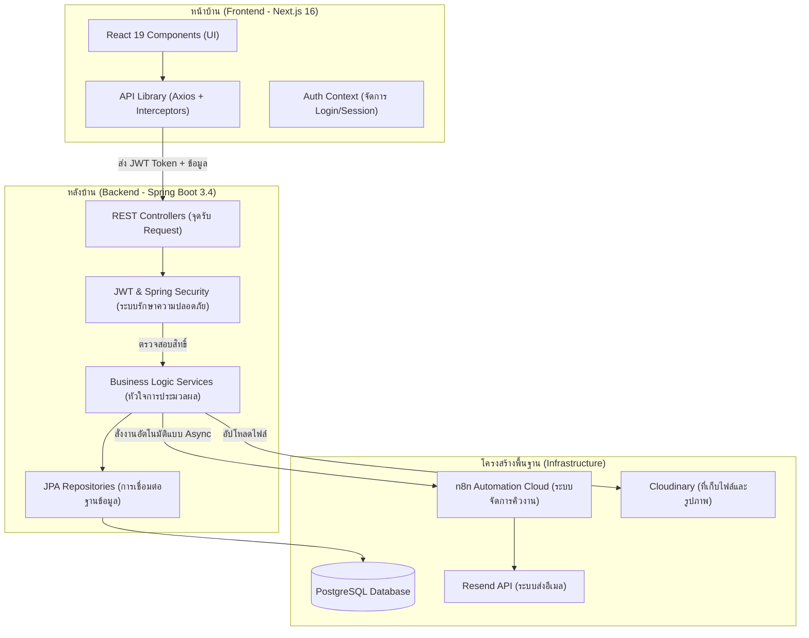

# 🎓 UTCC-TP: ระบบบริหารจัดการการฝึกงานและการเดินทาง (Trip & Internship Management)

**มหาวิทยาลัยหอการค้าไทย (University of the Thai Chamber of Commerce)**
ระบบ ATS (Applicant Tracking System) ระดับมืออาชีพที่ผสานพลัง AI และระบบ Automation เพื่อยกระดับการจัดการฝึกงาน

---

## 🏗️ สถาปัตยกรรมระบบและกระแสข้อมูล (System Architecture)

ระบบถูกออกแบบโดยแบ่งแยกหน้าที่อย่างชัดเจน (Separation of Concerns) เพื่อความเสถียรและความปลอดภัย:



---

## 📂 เจาะลึกโครงสร้างโฟลเดอร์และไฟล์ (Deep Dive)

### 💻 ภาคส่วนหน้าบ้าน: `/frontend`
พัฒนาด้วย **Next.js 16 (App Router)** ซึ่งเป็นเวอร์ชันล่าสุด

| โฟลเดอร์ / ไฟล์ | คำอธิบายโดยละเอียด |
|---|-|
| `app/` | **หัวใจของ Routing:** ทุกโฟลเดอร์คือ 1 หน้าเว็บ |
| `app/(app)/` | **Route กลุ่มที่มีการป้องกัน:** ต้อง Login เท่านั้นถึงจะเข้าได้ (Student, Advisor, Admin Dashboards) |
| `app/api/chat/` | **API Route สำหรับ Nexus AI:** ทำหน้าที่เป็นตัวกลางส่งข้อความจาก User ไปหา n8n หรือ Gemini |
| `components/` | **ส่วนประกอบ UI ที่นำกลับมาใช้ใหม่ได้:** ช่วยให้โค้ดสะอาดและจัดการง่าย |
| `components/RoleDashboardShell.js` | **เฟรมเวิร์กหลักของ Dashboard:** ตรวจสอบ Role ของ User และแสดงเมนูข้าง (Sidebar) ที่ต่างกัน |
| `components/ApplicationForm.js` | **แบบฟอร์มสมัครงาน 5 ขั้นตอน:** จัดการข้อมูลส่วนตัว, ประวัติการเรียน, และการอัปโหลดไฟล์ (Resume/Transcript) |
| `components/NexusChat.js` | **ปุ่มแชท AI ลอยตัว:** อินเตอร์เฟซสำหรับคุยกับระบบ Nexus AI |
| `lib/api.js` | **Axios Instance:** ตั้งค่า Base URL และดักจับ Request เพื่อแนบ JWT Token อัตโนมัติ |
| `lib/statusConfig.js` | **การตั้งค่าสถานะ (Status):** กำหนดสีและไอคอนของสถานะการสมัครงาน (เช่น Pending = สีเหลือง, Approved = สีเขียว) |

---

### ⚙️ ภาคส่วนหลังบ้าน: `/src/main/java/org/example/utcctp`
พัฒนาด้วย **Spring Boot 3.4 (Java 21)** เน้นความเร็วและความปลอดภัยระดับ Enterprise

| แพ็กเกจ (Package) | คำอธิบายโดยละเอียด |
|---|-|
| `api/` | **Controllers:** ส่วนที่รับคำสั่งจาก Frontend เช่น `ApplicationController` รับการสมัครงาน, `InternshipController` จัดการประกาศรับสมัคร |
| `auth/` | **ระบบยืนยันตัวตน:** จัดการการสมัครสมาชิก (Signup), การเข้าสู่ระบบ (Login), และระบบ OTP ผ่านอีเมล |
| `model/` | **Entities:** นิยามโครงสร้างตารางในฐานข้อมูล (เช่น User, InternshipPosition, Application, AuditLog) |
| `service/` | **Business Logic:** หัวใจสำคัญที่ควบคุมกฎเกณฑ์ เช่น `ApplicationService` จะคอยตรวจสอบว่าสถานะการสมัครเปลี่ยนจาก 'ยื่นคำขอ' เป็น 'สัมภาษณ์' ได้เมื่อไหร่ |
| `notification/` | **WebhookService:** ระบบส่งสัญญาณไปหา n8n เพื่อเริ่มทำงานอัตโนมัติ เช่น ส่งเมลแจ้งเตือนเมื่อได้งาน |
| `security/` | **Security Config:** ตั้งค่าว่าใครเข้าหน้าไหนได้บ้าง (Role-based Access Control) และจัดการ JWT Filter |
| `storage/` | **Storage Logic:** ระบบจัดการไฟล์ที่รองรับทั้งเก็บในเครื่อง (Local) และเก็บบน Cloud (Cloudinary) |
| `repository/` | **JPA Repositories:** ส่วนที่คุยกับฐานข้อมูล PostgreSQL โดยตรงด้วยคำสั่ง SQL หรือ Method Name |

---

## 🤖 ระบบอัตโนมัติด้วย n8n (Automation Workflows)

เราใช้ n8n Cloud ในการจัดการงานที่ต้องใช้เวลาประมวลผลสูง (Background Tasks):

1.  **OTP Delivery:** รับคำขอจาก Backend -> ส่งอีเมลรหัส OTP ให้ User ทันที
2.  **Application Pipeline:** เมื่อสถานะการสมัครเปลี่ยน -> n8n จะส่งอีเมลแจ้งทั้งนักศึกษาและบริษัท
3.  **AI Resume Screening:** (อยู่ระหว่างพัฒนา) ใช้ AI วิเคราะห์ความเหมาะสมของ Resume กับตำแหน่งงาน
4.  **Nexus AI Assistant:** รับข้อความแชทจากหน้าเว็บ -> ประมวลผลผ่าน LLM (Gemini/OpenRouter) -> ตอบกลับ User

---

## 🔐 ระบบความปลอดภัยและการตรวจสอบ (Security & Audit)

*   **JWT (JSON Web Token):** ใช้สำหรับการจดจำ Session ของ User อย่างปลอดภัย ไม่มีการเก็บ Cookie ที่เสี่ยงต่อการแฮ็ก
*   **Role-based Access:** ระบบแยกสิทธิ์ชัดเจน:
    *   `STUDENT`: สมัครงาน, แก้ไขโปรไฟล์, รายงานตัว
    *   `COMPANY`: ประกาศงาน, นัดสัมภาษณ์, ส่ง Offer
    *   `ADVISOR`: ตรวจสอบสถานะเด็ก, อนุมัติการฝึกงาน
    *   `ADMIN`: ดู Audit Logs, จัดการผู้ใช้, ดูสถิติรวม
*   **Audit Logging:** ทุกการกระทำที่สำคัญ (เช่น การเปลี่ยนคะแนนสัมภาษณ์ หรือการลบข้อมูล) จะถูกบันทึกลงตาราง `audit_logs` พร้อมระบุ IP Address และ Browser ที่ใช้

---

## 🚀 ลิงก์สำคัญ (Production Links)

*   **หน้าเว็บ (Frontend):** [https://utcc-tp-indol.vercel.app](https://utcc-tp-indol.vercel.app)
*   **ระบบหลังบ้าน (Backend):** [https://utcc-tp-backend.onrender.com](https://utcc-tp-backend.onrender.com)
*   **API Health Check:** [https://utcc-tp-backend.onrender.com/actuator/health](https://utcc-tp-backend.onrender.com/actuator/health)

---

## 💻 วิธีการติดตั้งและรันระบบ (Local Setup)

### 1. ระบบหลังบ้าน (Backend - Spring Boot)
ต้องมี Java 21 ติดตั้งในเครื่อง:
```bash
# รันด้วยฐานข้อมูล H2 (In-memory) ไม่ต้องตั้งค่าฐานข้อมูล
./mvnw spring-boot:run
```
*   ระบบจะรันที่: `http://localhost:8080`
*   หน้าทดสอบ API (Swagger): `http://localhost:8080/swagger-ui.html`

### 2. ระบบหน้าบ้าน (Frontend - Next.js)
ต้องมี Node.js ติดตั้งในเครื่อง:
```bash
cd frontend
npm install
npm run dev
```
*   ระบบจะรันที่: `http://localhost:3000`

---

## 🗄️ การจัดการฐานข้อมูล (Database Migrations)
เราใช้ **Flyway** ในการควบคุมเวอร์ชันของฐานข้อมูล ไฟล์ทั้งหมดอยู่ที่ `src/main/resources/db/migration/`

*   **V1 - V5:** โครงสร้างพื้นฐาน, ระบบความปลอดภัย, และ Audit Logs
*   **V8:** ส่วนขยายสำหรับ Phase 1 (แบบฟอร์มสมัครงานและรายละเอียดตำแหน่งงานแบบละเอียด)
*   **V11:** ระบบรายงาน (Reports) และการส่งงานของนักศึกษา

---

## 🛠️ รายการตัวแปรสภาพแวดล้อม (Environment Variables)
ดูได้ที่ไฟล์ `.env.example` (Backend) และ `frontend/.env.example` (Frontend)

**ตัวที่สำคัญที่สุด:**
*   `JWT_SECRET`: รหัสลับสำหรับสร้าง Token (ห้ามเปิดเผย)
*   `DATABASE_URL`: ลิงก์เชื่อมต่อฐานข้อมูล PostgreSQL
*   `RESEND_API_KEY`: คีย์สำหรับส่งอีเมลผ่านระบบ Resend
*   `CORS_ALLOWED_ORIGINS`: รายชื่อ URL ที่อนุญาตให้เรียกใช้ API (เช่น https://utcc-tp.vercel.app)

---

## 🤖 เจาะลึกระบบ AI & n8n Automation (Architecture)

ระบบ UTCC-TP ใช้การทำงานร่วมกันระหว่าง **Next.js API**, **Google Gemini**, และ **n8n Cloud** เพื่อสร้างประสบการณ์การใช้งานที่อัจฉริยะ

### 1. ระบบแชทอัจฉริยะ (Nexus AI)
*   **ทางเลือกที่ 1 (n8n Agent):** เมื่อ User ส่งข้อความ ระบบจะเรียกไปที่ n8n Workflow `BiEg41hprG3e37wX`. ภายใน n8n จะมี AI Agent ที่ติดตั้งเครื่องมือ (Tools) เช่น เครื่องคิดเลข และระบบดึงข้อมูลตำแหน่งงาน เพื่อให้คำแนะนำที่แม่นยำกว่า AI ทั่วไป
*   **ทางเลือกที่ 2 (Gemini Fallback):** หากระบบ n8n ไม่พร้อมใช้งาน ระบบจะสลับไปใช้ Google Gemini SDK โดยตรงผ่านรหัส `GEMINI_API_KEY` เพื่อให้ระบบแชทยังคงทำงานได้ตลอดเวลา

### 2. ระบบทำงานอัตโนมัติเบื้องหลัง (n8n Webhooks)
เราใช้ไฟล์ **`WebhookService.java`** ในฝั่ง Backend เพื่อส่งคำสั่งไปยัง n8n ในรูปแบบ "ส่งแล้วไปต่อทันที" (Async) เพื่อไม่ให้หน้าเว็บช้า:
*   **การส่ง OTP:** เมื่อ User สมัครสมาชิก Java จะส่งรหัสไปให้ n8n -> n8n จัดการส่งเมลผ่าน Resend
*   **การนัดสัมภาษณ์:** เมื่อมีการนัดหมาย n8n จะเชื่อมต่อกับ **Google Calendar** เพื่อสร้างนัดหมายอัตโนมัติ
*   **การแจ้งเตือนสถานะ:** n8n จะรับหน้าที่ส่งอีเมลแจ้งเตือนทุกครั้งที่สถานะการสมัครงานมีการเปลี่ยนแปลง

---

## 📂 คำอธิบายไฟล์รายตัวแบบละเอียด (File-by-File Breakdown)

### ⚙️ หลังบ้าน (Backend - Java Spring Boot)

#### 📍 โฟลเดอร์ `api/` (จุดรับคำสั่ง)
*   **AdminController.java**: จัดการงานระบบ เช่น ดูประวัติการใช้งาน (Audit Logs) และการจัดการ User ทั่วไป
*   **AnalyticsController.java**: คำนวณตัวเลขสถิติ (Dashboard) เช่น จำนวนนักศึกษาที่ได้งานแบ่งตามคณะ
*   **ApplicationController.java**: หัวใจหลักของการสมัครงาน รับข้อมูลสมัคร, อัปโหลดไฟล์, และอัปเดตสถานะ
*   **AuthController.java**: จัดการการเข้าสู่ระบบ, การสมัครสมาชิก, และการรับ-ส่งรหัส OTP ผ่านเมล
*   **BookmarkController.java**: ระบบเก็บงานที่ชอบไว้ดูภายหลัง (Save Jobs)
*   **CompanyController.java**: จัดการข้อมูลบริษัท, แก้ไขประกาศงาน, และดูนักศึกษาที่สนใจบริษัท
*   **FileController.java**: จัดการการอัปโหลด/ดาวน์โหลดไฟล์ โดยตัดสินใจว่าจะเก็บในเครื่องหรือ Cloud
*   **InternshipController.java**: ใช้ค้นหาตำแหน่งงานว่าง และแสดงรายละเอียดของงานแบบเจาะลึก
*   **InterviewController.java**: จัดการคิวสัมภาษณ์และเชื่อมต่อกับ n8n เพื่อส่งอีเมลนัดหมาย
*   **ReportController.java**: จัดการการส่งรายงานรายสัปดาห์ของนักศึกษาและการประเมินผลของอาจารย์

#### 📍 โฟลเดอร์ `service/` (ตรรกะการทำงาน)
*   **ApplicationService.java**: ควบคุม "ชีวิต" ของการสมัครงาน (จากร่าง -> ส่งแล้ว -> พิจารณา -> ได้งาน)
*   **ReportService.java**: ระบบคัดกรองและจัดการรายงานฝึกงาน
*   **OfferService.java**: ระบบส่งข้อเสนอเข้าทำงานอย่างเป็นทางการ (Job Offer)
*   **TripService.java**: จัดการแผนการเดินทางของอาจารย์เพื่อไปตรวจเยี่ยมนักศึกษาที่บริษัท

#### 📍 โฟลเดอร์ `notification/` (การติดต่อสื่อสาร)
*   **WebhookService.java**: ตัวเชื่อมต่อกับ n8n Cloud ส่งคำสั่งอัตโนมัติแบบเบื้องหลัง (Background Task)
*   **EmailService.java**: จัดการแม่แบบอีเมลและส่งออกผ่านระบบ Resend
*   **NotificationService.java**: ส่งสัญญาณแจ้งเตือนแบบ Real-time เข้าไปที่หน้าเว็บของ User โดยตรง

#### 📍 โฟลเดอร์ `security/` (ความปลอดภัย)
*   **JwtAuthFilter.java**: ด่านหน้าคอยตรวจบัตร (Token) ของ User ทุกครั้งที่มีการเรียก API
*   **SecurityConfig.java**: กำหนดกฎว่า "ใครเข้าหน้าไหนได้บ้าง" และตั้งค่าความปลอดภัยพื้นฐาน

---

### 💻 หน้าบ้าน (Frontend - Next.js 16)

#### 📍 โฟลเดอร์ `app/` (หน้าเว็บ)
*   **app/api/chat/route.js**: ตัวกลางที่คุยกับ AI (n8n/Gemini) เพื่อตอบคำถามผู้ใช้
*   **(app)/student/**: รวมหน้าเว็บสำหรับนักศึกษา เช่น หน้าค้นหางาน, หน้าดูสถานะตัวเอง
*   **(app)/company/**: รวมหน้าเว็บสำหรับบริษัท เช่น หน้าลงประกาศงาน, หน้าคัดเลือกผู้สมัคร
*   **(app)/advisor/**: รวมหน้าเว็บสำหรับอาจารย์ เช่น หน้าตรวจรายงาน, หน้าดูสถิติเด็กในความดูแล

#### 📍 โฟลเดอร์ `components/` (ชิ้นส่วน UI)
*   **ApplicationForm.js**: แบบฟอร์มขนาดใหญ่ที่แบ่งเป็นขั้นตอน (Step-by-step) เพื่อให้ User ใช้งานง่าย
*   **NexusChat.js**: กล่องแชทอัจฉริยะที่มุมขวาล่างของจอ ช่วยตอบคำถามและแนะนำเมนูต่างๆ
*   **RoleDashboardShell.js**: โครงสร้างหลักของ Dashboard ที่จะเปลี่ยนเมนูข้างตามสิทธิ์ของผู้ใช้งาน
*   **ApplicationTimeline.js**: กราฟแสดงสถานะการสมัครงาน ช่วยให้นักศึกษารู้ว่าตอนนี้ถึงขั้นตอนไหนแล้ว

#### 📍 โฟลเดอร์ `lib/` (เครื่องมือเสริม)
*   **api.js**: ตัวจัดการการเชื่อมต่อกับหลังบ้าน ถ้า Token หมดอายุจะทำการ Logout ให้อัตโนมัติ
*   **statusConfig.js**: ศูนย์รวมการตั้งค่าสถานะ (เช่น Approved ต้องเป็นสีเขียว พร้อมไอคอน Checkmark)
