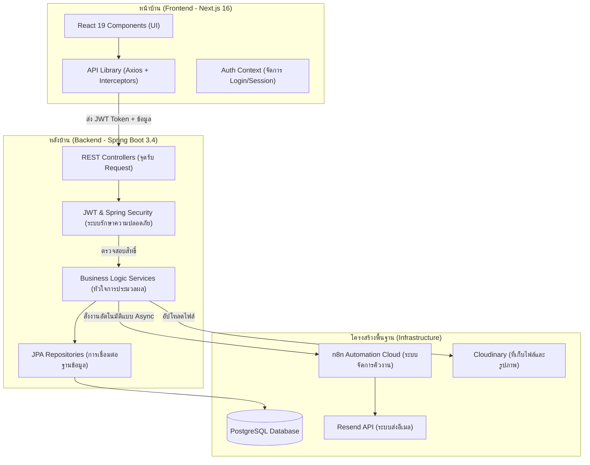
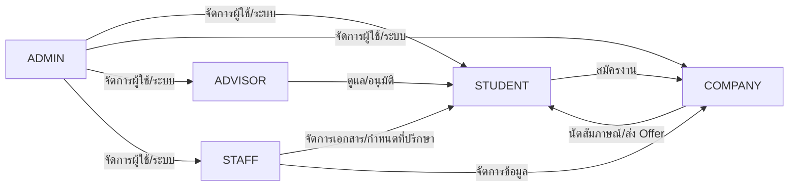

# 🎓 UTCC-TP: ระบบบริหารจัดการการฝึกงานและศึกษาดูงาน

**มหาวิทยาลัยหอการค้าไทย (University of the Thai Chamber of Commerce)**
ระบบ ATS (Applicant Tracking System) ระดับมืออาชีพที่ผสานพลัง AI และระบบ Automation เพื่อยกระดับการจัดการฝึกงาน

🌐 **เว็บไซต์:** [https://utcc-tp-indol.vercel.app](https://utcc-tp-indol.vercel.app)
🖥️ **Backend API:** [https://utcc-tp-backend.onrender.com](https://utcc-tp-backend.onrender.com)

---

## 📖 สารบัญ (Table of Contents)

- [ภาพรวมระบบ](#-ภาพรวมระบบ)
- [เทคโนโลยีที่ใช้](#-เทคโนโลยีที่ใช้)
- [สถาปัตยกรรมระบบ](#️-สถาปัตยกรรมระบบ)
- [บทบาทผู้ใช้งาน](#-บทบาทผู้ใช้งาน-user-roles)
- [คู่มือการใช้งาน – หน้าสาธารณะ](#-คู่มือการใช้งาน--หน้าสาธารณะ-public-pages)
- [คู่มือการใช้งาน – นักศึกษา](#-คู่มือการใช้งาน--นักศึกษา-student)
- [คู่มือการใช้งาน – บริษัท](#-คู่มือการใช้งาน--บริษัท-company)
- [คู่มือการใช้งาน – อาจารย์ที่ปรึกษา](#-คู่มือการใช้งาน--อาจารย์ที่ปรึกษา-advisor)
- [คู่มือการใช้งาน – เจ้าหน้าที่](#-คู่มือการใช้งาน--เจ้าหน้าที่-staff)
- [คู่มือการใช้งาน – ผู้ดูแลระบบ](#️-คู่มือการใช้งาน--ผู้ดูแลระบบ-admin)
- [ฟีเจอร์พิเศษ](#-ฟีเจอร์พิเศษ)
- [โครงสร้างโฟลเดอร์](#-โครงสร้างโฟลเดอร์)
- [วิธีการติดตั้ง](#-วิธีการติดตั้งและรันระบบ)
- [ตัวแปรสภาพแวดล้อม](#️-ตัวแปรสภาพแวดล้อม)
- [ระบบความปลอดภัย](#-ระบบความปลอดภัย)
- [ระบบ AI & Automation](#-ระบบ-ai--automation)
- [บัญชีทดสอบ](#-บัญชีทดสอบ-demo-accounts)

---

## 🌟 ภาพรวมระบบ

UTCC-TP เป็นแพลตฟอร์มบริหารจัดการแบบครบวงจร (End-to-End) สำหรับกิจกรรมฝึกงานและศึกษาดูงานของมหาวิทยาลัยหอการค้าไทย โดยเชื่อมโยงผู้มีส่วนเกี่ยวข้องทั้งหมดไว้ในระบบเดียว:

| ผู้ใช้งาน | บทบาทหลัก |
|---|---|
| **นักศึกษา** | ค้นหาและสมัครฝึกงาน, จัดการ Resume, ส่งรายงาน |
| **บริษัท/สถานประกอบการ** | ประกาศตำแหน่งฝึกงาน, คัดเลือกผู้สมัคร, นัดสัมภาษณ์, ส่ง Offer |
| **อาจารย์ที่ปรึกษา** | ดูแลนักศึกษา, ตรวจรายงาน, อนุมัติเอกสาร |
| **เจ้าหน้าที่** | จัดการเอกสาร, กำหนดอาจารย์ที่ปรึกษา, ดูแลระบบ |
| **ผู้ดูแลระบบ (Admin)** | จัดการผู้ใช้ทั้งหมด, ดู Audit Logs, ตั้งค่าระบบ |

---

## 🛠 เทคโนโลยีที่ใช้

| ส่วน | เทคโนโลยี |
|---|---|
| **Frontend** | Next.js 16, React 19, CSS Design System |
| **Backend** | Spring Boot 3.4, Java 21 |
| **Database** | PostgreSQL + Flyway Migrations |
| **Authentication** | JWT (JSON Web Token) + OTP via Email |
| **AI** | Google Gemini SDK, n8n AI Agent |
| **Automation** | n8n Cloud Workflows |
| **Storage** | Cloudinary (Cloud) + Local Storage |
| **Email** | Resend API |
| **Deployment** | Vercel (Frontend), Render (Backend) |

---

## 🏗️ สถาปัตยกรรมระบบ



---

## 👥 บทบาทผู้ใช้งาน (User Roles)

ระบบมี 5 บทบาทหลัก แต่ละบทบาทมีสิทธิ์การเข้าถึงและเมนูที่แตกต่างกัน:



---

## 🌐 คู่มือการใช้งาน – หน้าสาธารณะ (Public Pages)

### 1. หน้าแรก (Landing Page) — `/`

หน้าแรกของเว็บไซต์ที่ทุกคนสามารถเข้าถึงได้โดยไม่ต้องเข้าสู่ระบบ ประกอบด้วย:

| ส่วน | รายละเอียด |
|---|---|
| **Navbar** | แถบนำทางด้านบนสุด มีลิงก์ไปยังฟีเจอร์, เกี่ยวกับเรา, และปุ่ม "เข้าสู่ระบบ" |
| **Hero Section** | ส่วนหลักที่แสดงชื่อระบบ, คำอธิบาย, วิดีโอพื้นหลัง, และการ์ดเลือกบทบาท (นักศึกษา / บริษัท / อาจารย์) เพื่อนำทางไปยังหน้าล็อกอิน |
| **Stats Bar** | แถบสถิติ: 50+ บริษัทพันธมิตร, 120+ ทริปสำเร็จ, 94% อัตราความสำเร็จ, 2,000+ นักศึกษา |
| **How It Works** | ขั้นตอนการใช้งาน 4 ขั้นตอน: สมัคร → ค้นหา → สมัคร → เริ่มฝึก |
| **Features Bento** | แสดงฟีเจอร์เด่นของระบบในรูปแบบ Bento Grid |
| **Internship News** | ข่าวสารและประกาศรับสมัครฝึกงานล่าสุด |
| **About Section** | เกี่ยวกับมหาวิทยาลัย พร้อมวิดีโอแนะนำ |
| **FAQ** | คำถามที่พบบ่อย พร้อมคำตอบแบบ Accordion |
| **Footer** | ข้อมูลติดต่อ, ลิงก์นำทาง, และโซเชียลมีเดีย |

**การใช้งาน:**
- เลื่อนดูข้อมูลทั้งหมดในหน้า
- คลิก "เข้าสู่ระบบ" ที่ Navbar หรือ Role Cards เพื่อไปยังหน้าล็อกอิน
- ปุ่ม "Back to Top" จะปรากฏเมื่อเลื่อนลง สำหรับกลับไปด้านบน

---

### 2. หน้าเข้าสู่ระบบ (Login) — `/login`

| ส่วน | รายละเอียด |
|---|---|
| **แผงซ้าย** | แสดงภาพกราฟิกและคำอธิบายระบบ (ซ่อนบนมือถือ) |
| **แผงขวา** | ฟอร์มเข้าสู่ระบบ: ช่องกรอก Username และ Password |
| **Demo Accounts** | ปุ่มทดสอบระบบ 4 บทบาท: นักศึกษา, อาจารย์, บริษัท, ผู้ดูแลระบบ |

**การใช้งาน:**
1. กรอก **ชื่อผู้ใช้ (Username)** และ **รหัสผ่าน (Password)**
2. กดปุ่ม **"เข้าสู่ระบบ"**
3. ระบบจะนำทางไปยัง Dashboard ตามบทบาทของผู้ใช้โดยอัตโนมัติ
4. หากต้องการทดสอบ สามารถกดปุ่ม Demo Account ได้ทันที
5. ลิงก์ **"ลืมรหัสผ่าน?"** สำหรับรีเซ็ตรหัสผ่าน
6. ลิงก์ **"สมัครใหม่"** สำหรับสร้างบัญชีผู้ใช้ใหม่

---

### 3. หน้าสมัครสมาชิก (Sign Up) — `/signup`

| ฟิลด์ | รายละเอียด |
|---|---|
| **รหัสนักศึกษา / ชื่อผู้ใช้** | ใช้เป็น Username สำหรับเข้าสู่ระบบ |
| **สถานะ (Role)** | เลือกบทบาท: นักศึกษา, บริษัท, อาจารย์ที่ปรึกษา, เจ้าหน้าที่ |
| **ชื่อ-นามสกุล** | ชื่อเต็มที่จะแสดงในระบบ |
| **อีเมลมหาวิทยาลัย** | อีเมล @utcc.ac.th สำหรับรับ OTP |
| **รหัสผ่าน** | รหัสผ่านที่ต้องการใช้ |

**ขั้นตอนการสมัคร:**
1. กรอกข้อมูลให้ครบทุกช่อง
2. กดปุ่ม **"ส่งรหัส OTP ป้องกันบัญชี"**
3. ระบบจะส่งรหัส OTP ไปยังอีเมลที่กรอก
4. ยืนยัน OTP ที่หน้า `/signup/verify`
5. สมัครสำเร็จ → เข้าสู่ระบบได้ทันที

---

### 4. หน้าลืมรหัสผ่าน (Forgot Password) — `/forgot`

- กรอกอีเมลที่ใช้สมัครสมาชิก
- ระบบจะส่งลิงก์สำหรับตั้งรหัสผ่านใหม่ไปยังอีเมล
- คลิกลิงก์ในอีเมล → ตั้งรหัสผ่านใหม่ → เข้าสู่ระบบด้วยรหัสผ่านใหม่

---

## 🎓 คู่มือการใช้งาน – นักศึกษา (STUDENT)

เมื่อนักศึกษาเข้าสู่ระบบ จะถูกนำทางไปยัง Dashboard นักศึกษาโดยอัตโนมัติ

### เมนูนำทาง (Sidebar)

| เมนู | เส้นทาง | คำอธิบาย |
|---|---|---|
| 🏠 ภาพรวม | `/student/dashboard` | หน้าหลักแสดงสรุปข้อมูล |
| 👤 โปรไฟล์ | `/student/profile` | จัดการข้อมูลส่วนตัวและ Resume |
| 💼 ค้นหาฝึกงาน | `/student/internships` | ค้นหาตำแหน่งฝึกงานที่เปิดรับสมัคร |
| 📋 ใบสมัครของฉัน | `/student/applications` | ดูรายการใบสมัครทั้งหมดและสถานะ |
| 📅 นัดสัมภาษณ์ | `/student/interviews` | ดูรายการนัดหมายสัมภาษณ์ |
| 📄 รายงานฝึกงาน | `/student/reports` | ส่งและจัดการรายงานฝึกงานรายสัปดาห์ |
| 🔔 การแจ้งเตือน | `/student/notifications` | ดูการแจ้งเตือนทั้งหมด |
| 📊 สถิติแพลตฟอร์ม | `/analytics` | ดูสถิติภาพรวมของระบบ |
| 💬 ข้อความ | `/messages` | ระบบข้อความภายในแพลตฟอร์ม |

---

### หน้า: ภาพรวม (Student Dashboard) — `/student/dashboard`

แสดงข้อมูลสรุปสำคัญของนักศึกษา:

- **การ์ดสถิติ 4 ใบ:**
  - จำนวนใบสมัคร
  - นัดสัมภาษณ์ที่รอดำเนินการ
  - ข้อเสนองานที่ได้รับ
  - จำนวนรายงานที่ส่งแล้ว

- **การกระทำด่วน (Quick Actions):**
  - ค้นหาฝึกงาน
  - ดูใบสมัครของฉัน
  - นัดสัมภาษณ์
  - รายงานฝึกงาน

- **กิจกรรมล่าสุด:** ไทม์ไลน์แสดงเหตุการณ์ล่าสุด เช่น "ส่งใบสมัครสำเร็จ", "ได้รับนัดสัมภาษณ์" เป็นต้น

---

### หน้า: โปรไฟล์ (Profile) — `/student/profile`

- แก้ไขข้อมูลส่วนตัว: ชื่อ, อีเมล, เบอร์โทร
- อัปโหลดรูปโปรไฟล์
- จัดการ **Resume** ออนไลน์ (`/student/profile/resume`):
  - สรุปตัวเอง (Summary)
  - ทักษะ (Skills)
  - การศึกษา (Education)
  - ประสบการณ์ (Experience)
  - ลิงก์ Portfolio

---

### หน้า: ค้นหาฝึกงาน (Internships) — `/student/internships`

- ค้นหาตำแหน่งฝึกงานที่เปิดรับสมัครจากบริษัทต่างๆ
- กรองตามสาขา, ประเภทงาน, หรือบริษัท
- ดูรายละเอียดตำแหน่ง: คุณสมบัติ, ค่าตอบแทน, ระยะเวลา
- กดปุ่ม **"สมัคร"** เพื่อเริ่มกรอกใบสมัครฝึกงาน

---

### หน้า: ใบสมัครของฉัน (My Applications) — `/student/applications`

- ดูรายการใบสมัครทั้งหมดพร้อมสถานะ:
  - 📝 **ร่าง (Draft)** — กำลังกรอกข้อมูล
  - ⏳ **รอพิจารณา (Pending)** — ส่งแล้ว รอบริษัทพิจารณา
  - 🔍 **กำลังพิจารณา (Reviewing)** — บริษัทกำลังดูใบสมัคร
  - 📅 **นัดสัมภาษณ์ (Interview Scheduled)** — มีนัดสัมภาษณ์แล้ว
  - 📩 **ได้รับ Offer (Offer Extended)** — บริษัทส่งข้อเสนอแล้ว
  - ✅ **ตอบรับแล้ว (Accepted)** — นักศึกษาตอบรับข้อเสนอ
  - ❌ **ปฏิเสธแล้ว (Rejected)** — ใบสมัครถูกปฏิเสธ
- สามารถดูรายละเอียดแต่ละใบสมัครได้ (`/applications/[id]`)

---

### หน้า: รายงานฝึกงาน (Reports) — `/student/reports`

- ส่งรายงานฝึกงานรายสัปดาห์
- ดูสถานะการตรวจรายงานจากอาจารย์ที่ปรึกษา
- ดูคอมเมนต์/ข้อเสนอแนะจากอาจารย์

---

## 🏢 คู่มือการใช้งาน – บริษัท (COMPANY)

### เมนูนำทาง (Sidebar)

| เมนู | เส้นทาง | คำอธิบาย |
|---|---|---|
| 🏠 ภาพรวม | `/dashboard` | หน้าหลักแสดงสรุปข้อมูล |
| 🏢 ข้อมูลบริษัท | `/company/profile` | จัดการข้อมูลบริษัท |
| 💼 ประกาศฝึกงาน | `/company/internships` | สร้างและจัดการประกาศรับสมัครฝึกงาน |
| 👥 ผู้สมัคร | `/company/applicants` | ดูรายชื่อผู้สมัครทั้งหมด |
| 📅 สัมภาษณ์ | `/company/interviews` | จัดการนัดหมายสัมภาษณ์ |
| 📝 ข้อเสนอ | `/company/offers` | จัดการข้อเสนองาน (Job Offers) |
| 👔 พนักงานฝึกงาน | `/company/interns` | ดูรายชื่อนักศึกษาที่กำลังฝึกงาน |
| 📊 สถิติแพลตฟอร์ม | `/analytics` | ดูสถิติภาพรวม |
| 💬 ข้อความ | `/messages` | ระบบข้อความ |

---

### หน้า: ข้อมูลบริษัท (Company Profile) — `/company/profile`

- แก้ไขชื่อบริษัท, ที่อยู่, เบอร์ติดต่อ
- อัปโหลดโลโก้บริษัท
- เพิ่มคำอธิบายบริษัท, วัฒนธรรมองค์กร
- ใส่ลิงก์เว็บไซต์และโซเชียลมีเดีย

### หน้า: ประกาศฝึกงาน (Internships) — `/company/internships`

- สร้างประกาศตำแหน่งฝึกงานใหม่:
  - ชื่อตำแหน่ง, รายละเอียดงาน
  - คุณสมบัติที่ต้องการ
  - ระยะเวลาฝึกงาน, ค่าตอบแทน
  - จำนวนที่รับ
- แก้ไข/ลบประกาศที่มีอยู่
- ดูจำนวนผู้สมัครต่อตำแหน่ง

### หน้า: ผู้สมัคร (Applicants) — `/company/applicants`

- ดูรายชื่อผู้สมัครทั้งหมดแยกตามตำแหน่ง
- ดู Resume ของผู้สมัคร (คลิกที่ชื่อหรือไอคอน Resume)
- **AI Screening Score:** ค่าความเหมาะสม (Match Score) ที่คำนวณโดย AI
- เปลี่ยนสถานะผู้สมัคร:
  - เลือก "นัดสัมภาษณ์" → จะเปิด Modal ให้เลือกวัน/เวลา
  - เลือก "ส่ง Offer" → จะเปิด Modal ให้กรอกรายละเอียดข้อเสนอ
- ดาวน์โหลดเอกสาร PDF ของผู้สมัคร
- **Bulk Actions:** เลือกหลายคนพร้อมกัน → อนุมัติ/ปฏิเสธทั้งหมด

### หน้า: สัมภาษณ์ (Interviews) — `/company/interviews`

- ดูรายการนัดหมายสัมภาษณ์ทั้งหมด
- กำหนด/แก้ไขวัน-เวลา-สถานที่สัมภาษณ์
- ระบบเชื่อมต่อ Google Calendar อัตโนมัติ (ผ่าน n8n)

### หน้า: ข้อเสนอ (Offers) — `/company/offers`

- ดูข้อเสนอที่ส่งไปแล้วทั้งหมด
- ติดตามสถานะว่านักศึกษาตอบรับหรือปฏิเสธ

---

## 👨‍🏫 คู่มือการใช้งาน – อาจารย์ที่ปรึกษา (ADVISOR)

### เมนูนำทาง (Sidebar)

| เมนู | เส้นทาง | คำอธิบาย |
|---|---|---|
| 🏠 ภาพรวม | `/dashboard` | Dashboard อาจารย์ที่ปรึกษา |
| 🎓 นักศึกษาในความดูแล | `/advisor/students` | ดูรายชื่อนักศึกษาที่รับผิดชอบ |
| 📄 ตรวจรายงาน | `/advisor/reports` | ตรวจและให้คะแนนรายงานฝึกงาน |
| ✅ อนุมัติเอกสาร | `/advisor/approvals` | อนุมัติ/ปฏิเสธเอกสารของนักศึกษา |
| 🔔 การแจ้งเตือน | `/advisor/notifications` | รายการแจ้งเตือน |
| 📊 สถิติแพลตฟอร์ม | `/analytics` | สถิติภาพรวม |
| 💬 ข้อความ | `/messages` | ระบบข้อความ |

---

### หน้า: นักศึกษาในความดูแล (Students) — `/advisor/students`

- ดูรายชื่อนักศึกษาที่อยู่ในความดูแลทั้งหมด
- ดูสถานะการฝึกงานของแต่ละคน
- คลิกเพื่อดูรายละเอียดและประวัติการสมัครงาน

### หน้า: ตรวจรายงาน (Reports) — `/advisor/reports`

- ดูรายงานฝึกงานที่นักศึกษาส่งเข้ามา
- ให้คะแนนและเขียนข้อเสนอแนะ (Comments)
- อนุมัติหรือส่งกลับให้แก้ไข

### หน้า: อนุมัติเอกสาร (Approvals) — `/advisor/approvals`

- รายการเอกสารที่รอการอนุมัติ
- ตรวจสอบและอนุมัติ/ปฏิเสธใบสมัครฝึกงาน

---

## 🏛 คู่มือการใช้งาน – เจ้าหน้าที่ (STAFF)

### เมนูนำทาง (Sidebar)

| เมนู | เส้นทาง | คำอธิบาย |
|---|---|---|
| 🏠 ภาพรวม | `/dashboard` | Dashboard เจ้าหน้าที่ |
| 📁 เอกสาร | `/staff/documents` | จัดการเอกสารระบบ |
| 🏢 บริษัท | `/staff/companies` | จัดการข้อมูลบริษัท |
| 👤 กำหนดอาจารย์ที่ปรึกษา | `/staff/assign-advisor` | มอบหมายอาจารย์ให้ดูแลนักศึกษา |
| 📋 การสมัคร | `/staff/applications` | ดูและจัดการใบสมัครทั้งหมด |
| 📊 สถิติแพลตฟอร์ม | `/analytics` | สถิติภาพรวม |
| 💬 ข้อความ | `/messages` | ระบบข้อความ |

---

### หน้า: กำหนดอาจารย์ที่ปรึกษา (Assign Advisor) — `/staff/assign-advisor`

- ดูรายชื่อนักศึกษาที่ยังไม่มีอาจารย์ที่ปรึกษา
- เลือกอาจารย์จากรายชื่อ → กดมอบหมาย
- สามารถเปลี่ยนอาจารย์ที่ปรึกษาได้ในภายหลัง

### หน้า: บริษัท (Companies) — `/staff/companies`

- ดูรายชื่อบริษัทที่ลงทะเบียนในระบบ
- ตรวจสอบข้อมูลและสถานะของบริษัท

---

## 🛡️ คู่มือการใช้งาน – ผู้ดูแลระบบ (ADMIN)

### เมนูนำทาง (Sidebar)

| เมนู | เส้นทาง | คำอธิบาย |
|---|---|---|
| 🏠 ภาพรวมระบบ | `/dashboard` | Dashboard Admin แสดงสถิติรวม |
| 👥 ผู้ใช้ | `/admin/users` | จัดการผู้ใช้ทั้งหมดในระบบ |
| 🔐 สิทธิ์การใช้งาน | `/admin/roles` | จัดการบทบาทและสิทธิ์ |
| 📋 Audit Logs | `/admin/audit` | ดูบันทึกการใช้งานระบบ |
| ⚙️ ตั้งค่าระบบ | `/admin/settings` | ตั้งค่าพารามิเตอร์ระบบ |
| 💬 ข้อความ | `/messages` | ระบบข้อความ |

---

### หน้า: ภาพรวมระบบ (Admin Dashboard) — `/admin/dashboard`

- **การ์ดสถิติ:** ผู้ใช้ทั้งหมด, บริษัททั้งหมด, ใบสมัครทั้งหมด, ตำแหน่งที่เปิดรับ
- **การกระทำด่วน:** จัดการผู้ใช้, จัดการบริษัท, จัดการสิทธิ์, Audit Logs
- **กิจกรรมล่าสุด:** รายการเหตุการณ์ล่าสุดในระบบ (สมัครใหม่, บริษัทใหม่, ใบสมัครใหม่)

### หน้า: ผู้ใช้ (Users) — `/admin/users`

ฟังก์ชันการจัดการผู้ใช้แบบครบถ้วน:

- ดูรายชื่อผู้ใช้ทั้งหมดในระบบ
- ค้นหา/กรองผู้ใช้ตามชื่อ, อีเมล, หรือบทบาท
- **เปลี่ยนรหัสผ่าน** ของผู้ใช้
- **เปลี่ยนบทบาท** (Role) ของผู้ใช้
- **ระงับ/เปิดใช้งาน** บัญชีผู้ใช้ (Suspend/Activate)
- **ลบผู้ใช้** ออกจากระบบ

### หน้า: Audit Logs — `/admin/audit`

- ดูบันทึกการกระทำทั้งหมดในระบบ
- แต่ละรายการแสดง: ผู้กระทำ, ประเภทการกระทำ, เวลา, IP Address, Browser
- กรอง Logs ตามช่วงเวลาหรือประเภท

### หน้า: ตั้งค่าระบบ (Settings) — `/admin/settings`

- ตั้งค่าพารามิเตอร์ระบบ
- การตั้งค่าอีเมล
- การตั้งค่า API Keys

---

## ✨ ฟีเจอร์พิเศษ

### 🤖 Nexus AI Assistant — `/chat`

ระบบ AI แชทบอทอัจฉริยะที่ช่วยเหลือผู้ใช้ทุกบทบาท:

- **เข้าถึงได้จากทุกหน้า** ผ่านปุ่มลอยตัว (Floating Button) มุมขวาล่าง
- **หน้า Chat เต็มจอ** ที่ `/chat`
- **คำถามแนะนำ (Presets):**
  - แนะนำที่ฝึกงานสาย IT
  - ต้องทำรายงานยังไง?
  - ตรวจสอบสถานะใบสมัคร
  - แนะนำวิธีทำ Resume
- ใช้ **Google Gemini** หรือ **n8n AI Agent** ในการประมวลผล

---

### 📊 สถิติแพลตฟอร์ม (Analytics) — `/analytics`

หน้าวิเคราะห์ข้อมูลแบบ Real-time:

- **KPI Cards 4 ใบ:** ใบสมัครทั้งหมด, ตำแหน่งงาน, ทริป, อัตราสำเร็จ
- **กราฟแท่ง:** ใบสมัครรายเดือน (6 เดือนย้อนหลัง)
- **Status Funnel:** แสดงจำนวนใบสมัครแยกตามสถานะ (Pipeline)
- **สัดส่วนสาขา:** แยกใบสมัครตามสาขาวิชา
- **อัตราการได้งาน:** แยกตามสาขาพร้อมเปอร์เซ็นต์

> ⚠️ หน้านี้ต้องเป็น Role **COMPANY**, **ADVISOR**, **STAFF**, หรือ **ADMIN** จึงจะเข้าได้ (STUDENT จะ Redirect กลับ Dashboard)

---

### 💬 ระบบข้อความ (Messages) — `/messages`

- ส่งข้อความถึงผู้ใช้คนอื่นในระบบ
- สนทนาแบบ Real-time
- แจ้งเตือนเมื่อมีข้อความใหม่

---

### 🔔 ระบบแจ้งเตือน (Notifications)

- แจ้งเตือนแบบ Real-time บน Topbar (ไอคอนกระดิ่ง พร้อมจำนวนที่ยังไม่อ่าน)
- หน้ารายการแจ้งเตือนทั้งหมดที่ `/notifications`
- แจ้งเตือนผ่านอีเมล (ผ่าน n8n + Resend)

---

### 📝 ระบบคัดเลือกผู้สมัคร (ATS - Recruitment) — `/recruitment`

ระบบจัดการผู้สมัครแบบครบวงจร:

- **ตาราง Applicant Tracking:** ดูผู้สมัครทั้งหมดในรูปแบบตาราง
- **AI Screening Score:** แสดง Match Score ของผู้สมัคร
- **เปลี่ยนสถานะ:** Dropdown เปลี่ยนสถานะ → เปิด Modal ตามเหมาะสม
- **ดู Resume:** คลิกเพื่อเปิด Modal แสดง Resume ของผู้สมัคร
- **ดาวน์โหลด PDF:** ดาวน์โหลดเอกสารใบสมัคร
- **Bulk Actions:** เลือกหลายรายการ → อนุมัติ/ปฏิเสธพร้อมกัน

---

## 📂 โครงสร้างโฟลเดอร์

```
UTCC-TP/
├── frontend/                  # ระบบหน้าบ้าน (Next.js 16)
│   ├── app/
│   │   ├── page.js            # หน้าแรก (Landing Page)
│   │   ├── login/             # หน้าเข้าสู่ระบบ
│   │   ├── signup/            # หน้าสมัครสมาชิก + OTP Verify
│   │   ├── forgot/            # หน้าลืมรหัสผ่าน
│   │   ├── api/chat/          # API Route สำหรับ Nexus AI
│   │   ├── css/               # Design System CSS Files
│   │   └── (app)/             # Protected Routes (ต้อง Login)
│   │       ├── dashboard/     # Dashboard Redirect
│   │       ├── student/       # หน้าสำหรับนักศึกษา
│   │       ├── company/       # หน้าสำหรับบริษัท
│   │       ├── advisor/       # หน้าสำหรับอาจารย์
│   │       ├── staff/         # หน้าสำหรับเจ้าหน้าที่
│   │       ├── admin/         # หน้าสำหรับผู้ดูแลระบบ
│   │       ├── analytics/     # หน้าสถิติ
│   │       ├── chat/          # หน้า Nexus AI Chat
│   │       ├── messages/      # หน้าข้อความ
│   │       ├── notifications/ # หน้าแจ้งเตือน
│   │       ├── profile/       # หน้าโปรไฟล์
│   │       └── recruitment/   # หน้าจัดการผู้สมัคร (ATS)
│   ├── components/            # ส่วนประกอบ UI ที่ใช้ซ้ำได้
│   └── lib/                   # Utility Libraries (API, Config)
│
├── src/                       # ระบบหลังบ้าน (Spring Boot 3.4)
│   └── main/java/org/example/utcctp/
│       ├── api/               # REST Controllers
│       ├── auth/              # ระบบยืนยันตัวตน
│       ├── model/             # Database Entities
│       ├── service/           # Business Logic
│       ├── repository/        # JPA Repositories
│       ├── security/          # JWT + Spring Security
│       ├── notification/      # Webhook + Email Services
│       └── storage/           # File Storage
│
├── pom.xml                    # Maven Configuration
├── docker-compose.yml         # Docker Setup
├── render.yaml                # Render Deployment Config
└── README.md                  # คู่มือนี้
```

---

## 💻 วิธีการติดตั้งและรันระบบ

### ข้อกำหนดเบื้องต้น

- **Node.js** 18+ (สำหรับ Frontend)
- **Java 21** (สำหรับ Backend)
- **PostgreSQL** (หรือใช้ H2 In-memory สำหรับทดสอบ)

### 1. รันระบบหลังบ้าน (Backend)

```bash
# Clone โปรเจกต์
git clone https://github.com/patzapaty13-crypto/UTCC-TP.git
cd UTCC-TP

# รันด้วยฐานข้อมูล H2 (ไม่ต้องตั้งค่า DB)
./mvnw spring-boot:run
```

> ระบบจะรันที่: `http://localhost:8080`
> Swagger API Docs: `http://localhost:8080/swagger-ui.html`

### 2. รันระบบหน้าบ้าน (Frontend)

```bash
cd frontend
npm install
npm run dev
```

> ระบบจะรันที่: `http://localhost:3000`

### 3. ตั้งค่า Environment Variables

คัดลอกไฟล์ `.env.example` แล้วตั้งค่าตามต้องการ:

```bash
# Backend
cp .env.example .env

# Frontend
cp frontend/.env.example frontend/.env.local
```

---

## ⚙️ ตัวแปรสภาพแวดล้อม

### Backend (`.env`)

| ตัวแปร | คำอธิบาย |
|---|---|
| `JWT_SECRET` | รหัสลับสำหรับสร้าง JWT Token (ห้ามเปิดเผย) |
| `DATABASE_URL` | ลิงก์เชื่อมต่อ PostgreSQL |
| `RESEND_API_KEY` | คีย์สำหรับส่งอีเมลผ่าน Resend |
| `CORS_ALLOWED_ORIGINS` | รายชื่อ URL ที่อนุญาตให้เรียก API |
| `CLOUDINARY_*` | คีย์สำหรับจัดเก็บไฟล์บน Cloud |

### Frontend (`.env.local`)

| ตัวแปร | คำอธิบาย |
|---|---|
| `NEXT_PUBLIC_API_URL` | URL ของ Backend API |
| `GEMINI_API_KEY` | คีย์ Google Gemini สำหรับ AI Chat |

---

## 🔐 ระบบความปลอดภัย

| ฟีเจอร์ | รายละเอียด |
|---|---|
| **JWT Authentication** | ใช้ Token สำหรับยืนยันตัวตน ไม่เก็บ Session บน Server |
| **Role-based Access (RBAC)** | แยกสิทธิ์ตามบทบาท 5 ระดับ |
| **OTP Verification** | ยืนยันอีเมลด้วยรหัส OTP ก่อนสมัครสมาชิก |
| **Audit Logging** | บันทึกทุกการกระทำพร้อม IP Address และ Browser |
| **CORS Configuration** | จำกัด Origin ที่อนุญาตให้เรียก API |
| **Password Hashing** | เข้ารหัสรหัสผ่านด้วย BCrypt |

---

## 🤖 ระบบ AI & Automation

### Nexus AI Chat

| ทางเลือก | รายละเอียด |
|---|---|
| **n8n Agent** | AI Agent พร้อมเครื่องมือ (Tools) เช่น ค้นหาตำแหน่งงาน, เครื่องคิดเลข |
| **Gemini Fallback** | หาก n8n ไม่พร้อม จะใช้ Google Gemini SDK โดยตรง |

### n8n Automation Workflows

1. **OTP Delivery:** สมัครสมาชิก → ส่งรหัส OTP ทางอีเมล
2. **Application Pipeline:** เปลี่ยนสถานะ → แจ้งเตือนนักศึกษาและบริษัท
3. **Interview Scheduling:** นัดสัมภาษณ์ → สร้างนัดหมายบน Google Calendar
4. **AI Resume Screening:** วิเคราะห์ความเหมาะสมของ Resume (อยู่ระหว่างพัฒนา)

---

## 🧪 บัญชีทดสอบ (Demo Accounts)

สามารถใช้บัญชีเหล่านี้เพื่อทดสอบระบบได้ทันที (รหัสผ่านทุกบัญชี: `pass123`):

| Username | Role | คำอธิบาย |
|---|---|---|
| `student1` | 🎓 นักศึกษา | ทดสอบฟังก์ชันนักศึกษา |
| `advisor1` | 👨‍🏫 อาจารย์ | ทดสอบฟังก์ชันอาจารย์ที่ปรึกษา |
| `company1` | 🏢 บริษัท | ทดสอบฟังก์ชันบริษัท |
| `admin1` | 🔐 ผู้ดูแลระบบ | ทดสอบฟังก์ชัน Admin |

---

## 🗄️ การจัดการฐานข้อมูล

ระบบใช้ **Flyway** ควบคุมเวอร์ชันฐานข้อมูล ไฟล์อยู่ที่ `src/main/resources/db/migration/`:

| เวอร์ชัน | คำอธิบาย |
|---|---|
| V1 - V5 | โครงสร้างพื้นฐาน, ระบบ Security, Audit Logs |
| V8 | ส่วนขยาย Phase 1 (แบบฟอร์มสมัครงานแบบละเอียด) |
| V11 | ระบบรายงาน (Reports) และการส่งงาน |

---

## 📄 License

© 2026 UTCC Trip & Internship Management Platform. All rights reserved.

---

<div align="center">
  <p>
    <strong>พัฒนาโดยนักศึกษามหาวิทยาลัยหอการค้าไทย</strong>
  </p>
  <p>
    <a href="https://utcc-tp-indol.vercel.app">🌐 เยี่ยมชมเว็บไซต์</a> •
    <a href="https://github.com/patzapaty13-crypto/UTCC-TP">📦 GitHub Repository</a>
  </p>
</div>
