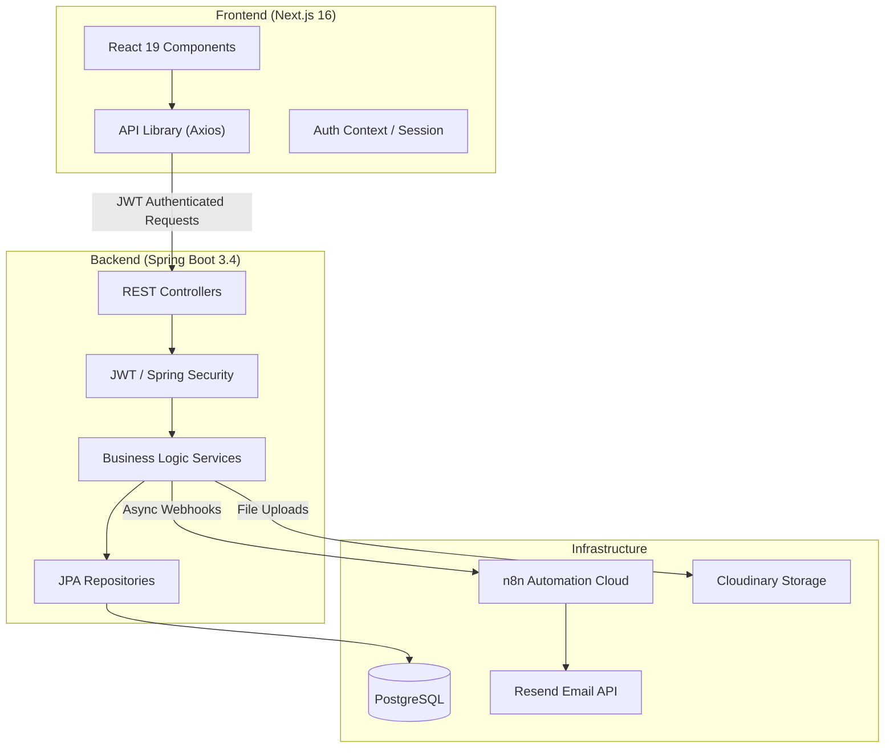

# 🎓 UTCC-TP: Trip & Internship Management Platform

**University of the Thai Chamber of Commerce**
A professional, automated Internship Application Tracking System (ATS) and Trip Management platform.

---

## 🏗️ System Architecture & Data Flow

The platform follows a modern full-stack architecture with clear separation of concerns:

### Flow Example: Internship Application
1. **Frontend**: Student fills out the `ApplicationForm.js` and submits.
2. **API**: `ApplicationController` receives the request.
3. **Security**: `JwtAuthFilter` validates the student's token.
4. **Service**: `ApplicationService` saves data, creates a status log, and fires an **n8n Webhook**.
5. **Automation**: n8n receives the webhook, generates a notification, and sends an email via **Resend**.

---

## 📂 Project Structure

### 💻 Frontend (`/frontend`)
Built with **Next.js 16 (App Router)** and **Tailwind CSS**.

| Folder / File | Description |
|---|-|
| `app/` | **Pages & API Routes.** Uses App Router hierarchy. |
| `app/(app)/` | Protected routes requiring login (Student, Advisor, Admin dashboards). |
| `app/auth/` | Login and role-based authentication entry points. |
| `app/api/chat/` | Nexus AI route — handles communication between UI and n8n/Gemini. |
| `components/` | **Reusable UI Components.** |
| `components/RoleDashboardShell.js` | The main layout for all dashboards (dynamic sidebar based on role). |
| `components/ApplicationForm.js` | The complex multi-step internship application form. |
| `components/NexusChat.js` | The floating AI assistant interface. |
| `lib/api.js` | Axios configuration with interceptors for JWT token management. |
| `lib/statusConfig.js` | Centralized config for application statuses (colors, icons, steps). |

### ⚙️ Backend (`/src/main/java/org/example/utcctp`)
Built with **Spring Boot 3.4** and **Java 21**.

| Package | Description |
|---|-|
| `api/` | **REST Controllers.** Entry points for frontend requests. |
| `auth/` | **Authentication Logic.** Handles OTP, Signup, and JWT generation. |
| `model/` | **JPA Entities.** Database schema definitions (User, Application, etc.). |
| `service/` | **Business Logic.** The "brain" of the app. Processes data and business rules. |
| `notification/` | **WebhookService.** Dispatches async events to n8n for emails/automation. |
| `security/` | **Spring Security Config.** Defines permissions and JWT filtering. |
| `storage/` | **Storage Providers.** Pluggable logic for Local vs Cloudinary uploads. |
| `repository/` | **Data Access.** Spring Data JPA interfaces for DB queries. |

### 🗄️ Database & Resources (`/src/main/resources`)
| Path | Description |
|---|-|
| `db/migration/` | **Flyway Scripts.** Versioned SQL migrations for schema evolution. |
| `application.properties` | Central configuration for DB, JWT, and n8n URLs. |

---

## 🛠️ Key Files & Their Functions

### Backend Highlights
- **`SecurityConfig.java`**: Configures CORS (allowing Vercel) and protects endpoints.
- **`ApplicationService.java`**: Manages the lifecycle of an internship (Draft -> Pending -> Approved -> Finished).
- **`WebhookService.java`**: Sends data to n8n. It is "fire-and-forget" to ensure the main UI stays fast.
- **`User.java`**: Supports multiple roles and stores extra data like `skills` and `experiences` as JSONB.

### Frontend Highlights
- **`api.js`**: Automatically attaches `Authorization: Bearer <token>` to every request.
- **`RoleDashboardShell.js`**: Renders different menus for `STUDENT`, `ADVISOR`, `COMPANY`, and `ADMIN`.
- **`ApplicationForm.js`**: Handles file uploads (Resume/Transcript) before submitting the final application.

---

## 🚀 Deployment Status

- **Frontend**: [https://utcc-tp-indol.vercel.app](https://utcc-tp-indol.vercel.app)
- **Backend**: [https://utcc-tp-backend.onrender.com](https://utcc-tp-backend.onrender.com)
- **Automation**: n8n Cloud (handling 9 production workflows)

---

## 📖 Maintenance
- To add a new database field: Add a new `V__xxx.sql` in `db/migration` and update the JPA Entity.
- To add a new dashboard page: Create a folder in `app/(app)/<role>/` and update `RoleDashboardShell.js` navigation.
